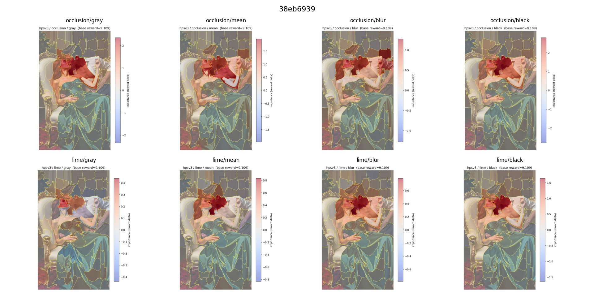
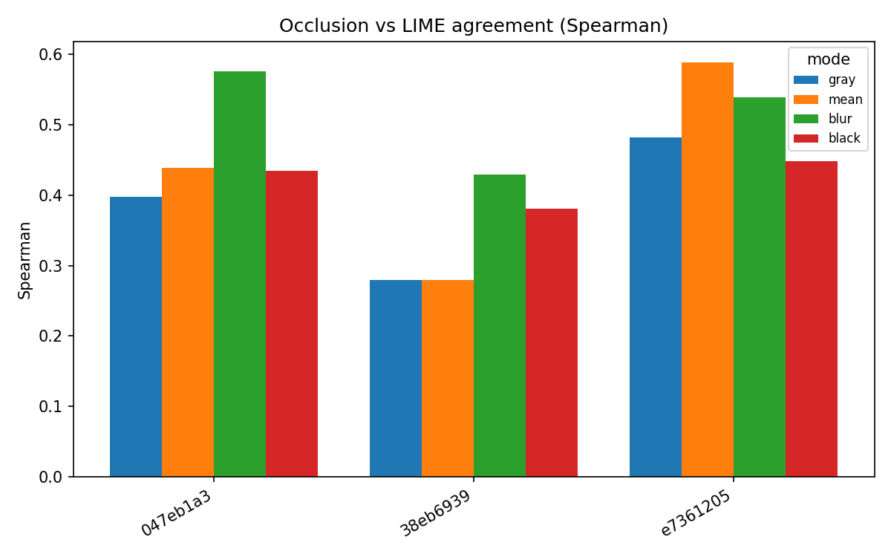
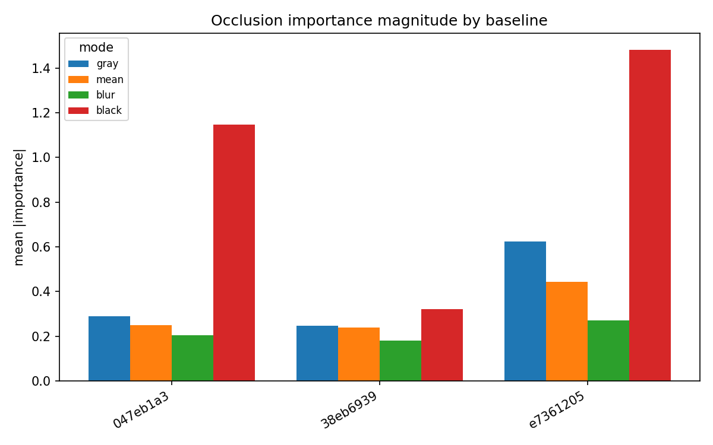
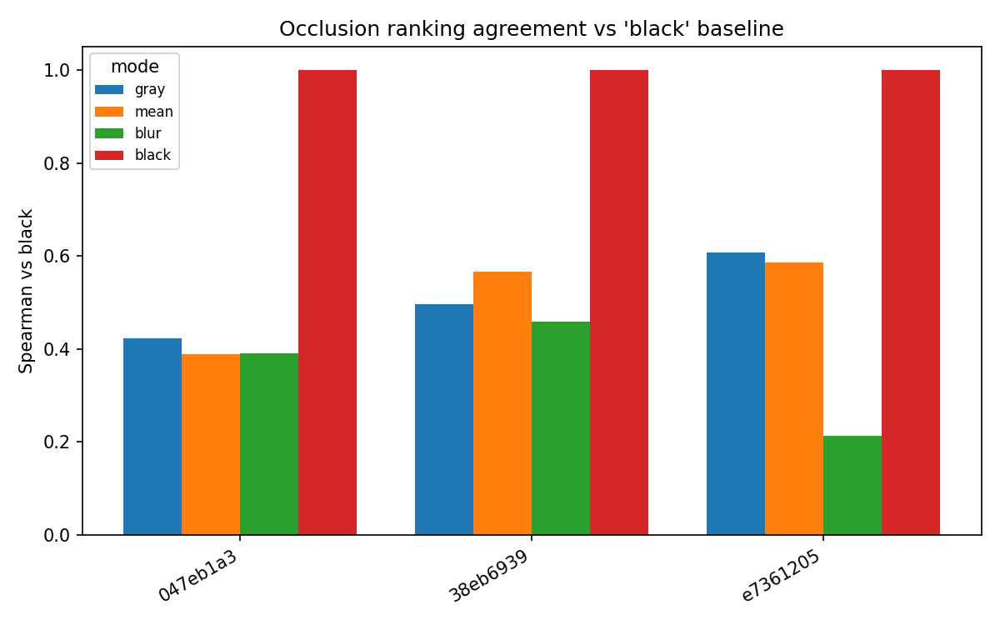
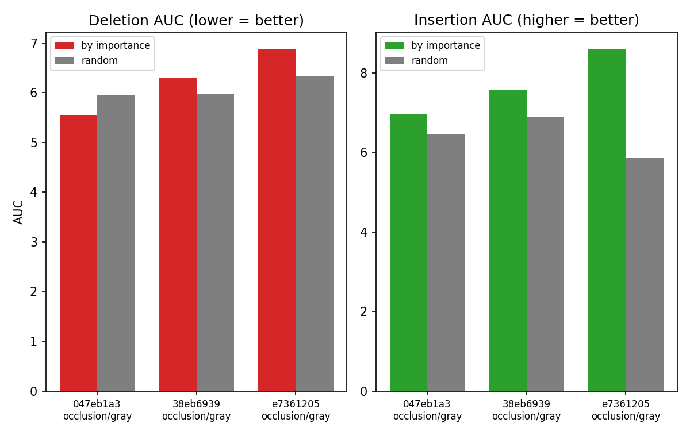

# HPSv3 Perturbation-Attribution Report

Results directory: `xai_24125228`  
Images: **3**  |  Methods: occlusion, LIME  |  Baselines: gray, mean, blur, black

## Overview

| image | prompt | base_reward | n_superpixels |
| --- | --- | --- | --- |
| 38eb6939 | The image captures a romantic scene featuring a couple in a … | 9.109 | 70 |
| e7361205 | Asian woman, gray strapless top, hand on chin, white backgro… | 11.182 | 78 |
| 047eb1a3 | Couple enjoys wine on balcony under a full moon. | 9.491 | 66 |

## 1. What the model rewards (per image)

### 38eb6939 — base reward μ = 9.109

Prompt: *The image captures a romantic scene featuring a couple in a passionate embrace. The woman, with auburn hair and fair skin, is reclining on a lavish cream-colored chaise lounge with intricate gilded details. She is wearing a flowing green gown that cascades around her, with shades of blue shimmering *

- Strongest positive region (occlusion/black): **+2.79**
- Fraction of regions that *hurt* the score: **28.6%** (min -0.24)

### e7361205 — base reward μ = 11.182

Prompt: *Asian woman, gray strapless top, hand on chin, white background.*

- Strongest positive region (occlusion/black): **+5.04**
- Fraction of regions that *hurt* the score: **0.0%** (min +0.11)

### 047eb1a3 — base reward μ = 9.491

Prompt: *Couple enjoys wine on balcony under a full moon.*

- Strongest positive region (occlusion/black): **+5.75**
- Fraction of regions that *hurt* the score: **7.6%** (min -0.07)

## 2. Occlusion vs LIME agreement (cross-method validation)

| image | mode | spearman_occ_vs_lime |
| --- | --- | --- |
| 38eb6939 | gray | 0.28 |
| 38eb6939 | mean | 0.28 |
| 38eb6939 | blur | 0.429 |
| 38eb6939 | black | 0.381 |
| e7361205 | gray | 0.482 |
| e7361205 | mean | 0.589 |
| e7361205 | blur | 0.539 |
| e7361205 | black | 0.448 |
| 047eb1a3 | gray | 0.398 |
| 047eb1a3 | mean | 0.439 |
| 047eb1a3 | blur | 0.576 |
| 047eb1a3 | black | 0.435 |

Mean Spearman = **0.44** (moderate). Positive across the board → the two methods localize the same regions.

## 3. Baseline (color-perturbation) sensitivity

| image | mode | spearman_vs_black |
| --- | --- | --- |
| 38eb6939 | gray | 0.496 |
| 38eb6939 | mean | 0.566 |
| 38eb6939 | blur | 0.458 |
| 38eb6939 | black | 1.0 |
| e7361205 | gray | 0.608 |
| e7361205 | mean | 0.585 |
| e7361205 | blur | 0.214 |
| e7361205 | black | 1.0 |
| 047eb1a3 | gray | 0.423 |
| 047eb1a3 | mean | 0.389 |
| 047eb1a3 | blur | 0.391 |
| 047eb1a3 | black | 1.0 |

Mean agreement of soft baselines vs black = **0.46** (moderate). Black gives the largest magnitudes; the choice of baseline shifts which regions look most important (the 'missingness' effect) → report multiple baselines.

## 4. Faithfulness (deletion / insertion)

| image | method | mode | deletion_auc | deletion_random | deletion_ok | insertion_auc | insertion_random | insertion_ok |
| --- | --- | --- | --- | --- | --- | --- | --- | --- |
| 047eb1a3 | occlusion | gray | 5.5548 | 5.9511 | ✓ | 6.961 | 6.4703 | ✓ |
| 38eb6939 | occlusion | gray | 6.3069 | 5.9804 | ✗ | 7.5708 | 6.8767 | ✓ |
| e7361205 | occlusion | gray | 6.8723 | 6.3433 | ✗ | 8.5909 | 5.8618 | ✓ |

Insertion passes **3/3**, deletion passes **1/3**. Insertion is the more reliable signal; with soft baselines (gray) the deletion AUC can be inflated by the curve recovering toward the neutral-baseline score — compare the black baseline for a cleaner deletion test.

## 5. Limitations

- Sample size: **3 images** — illustrative, not statistically general.

- All images are high-scoring; no low-quality contrast case.

- LIME has sampling noise; check stability across seeds before strong claims.
