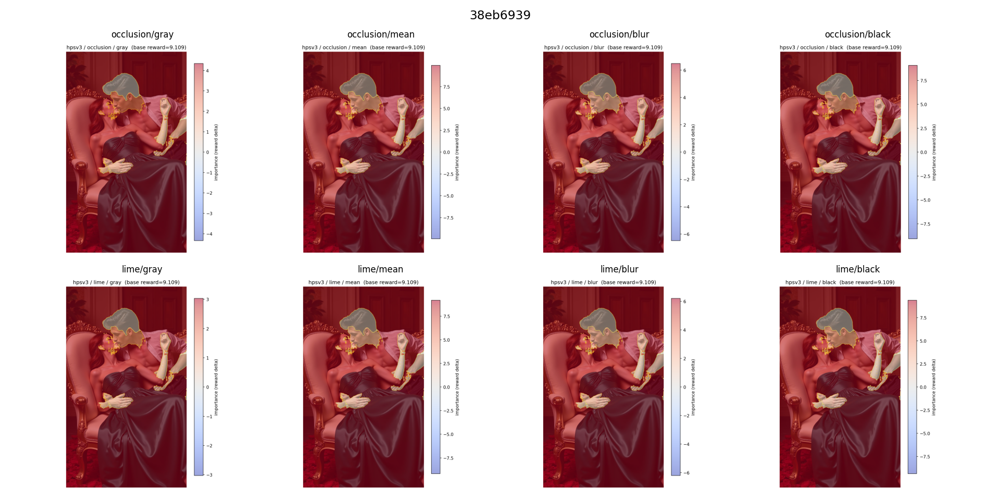
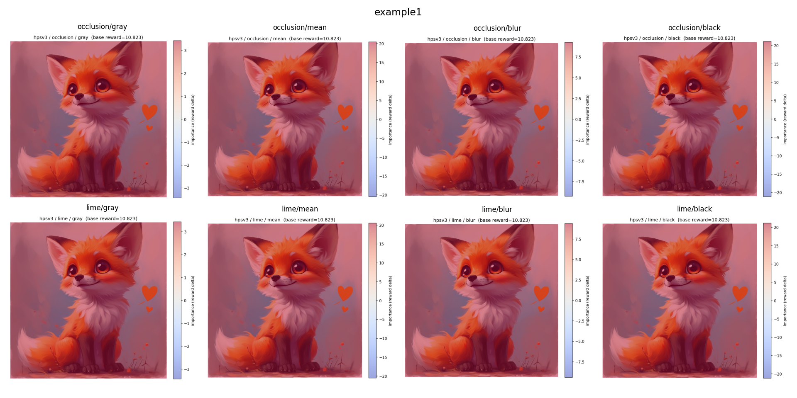
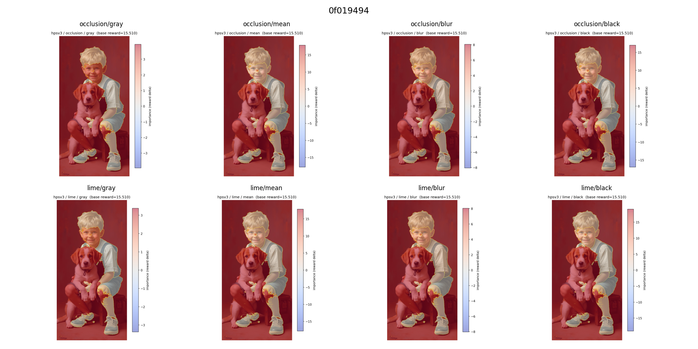
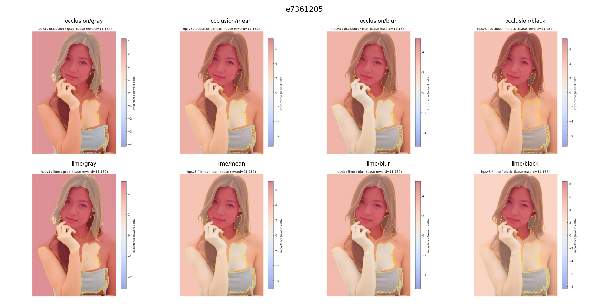
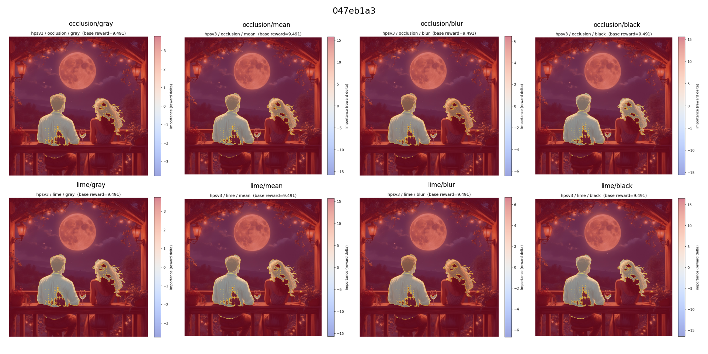
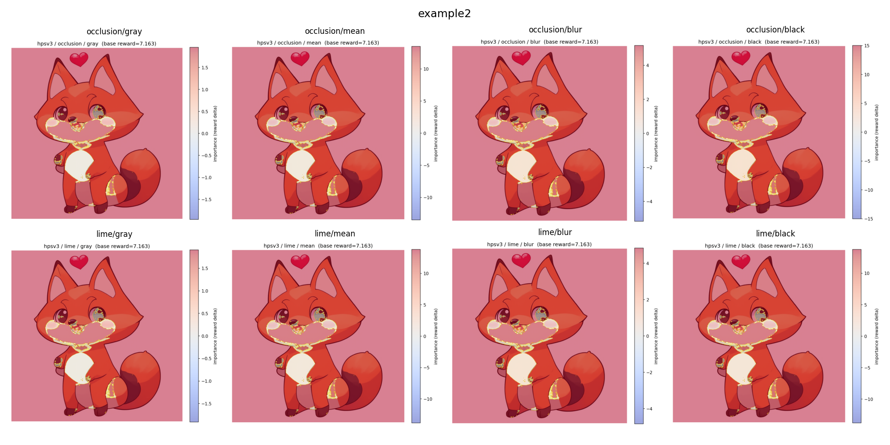
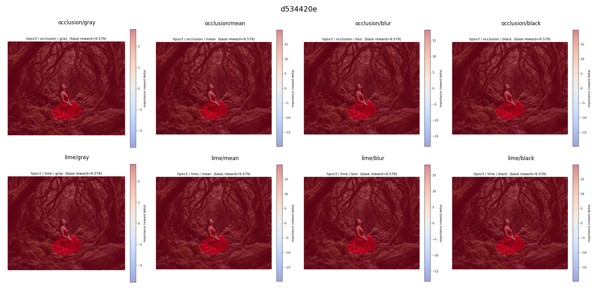
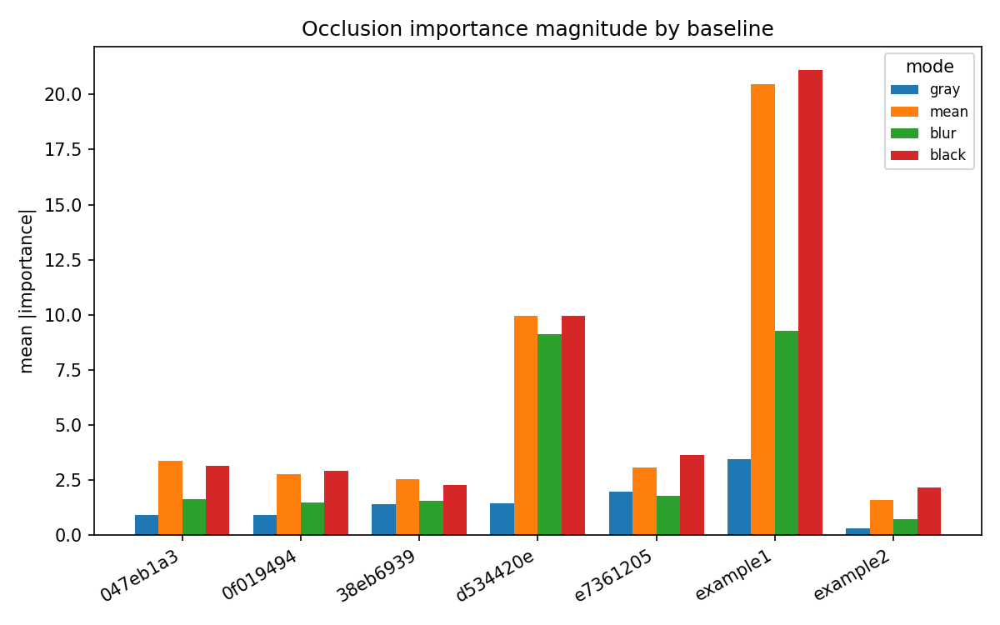
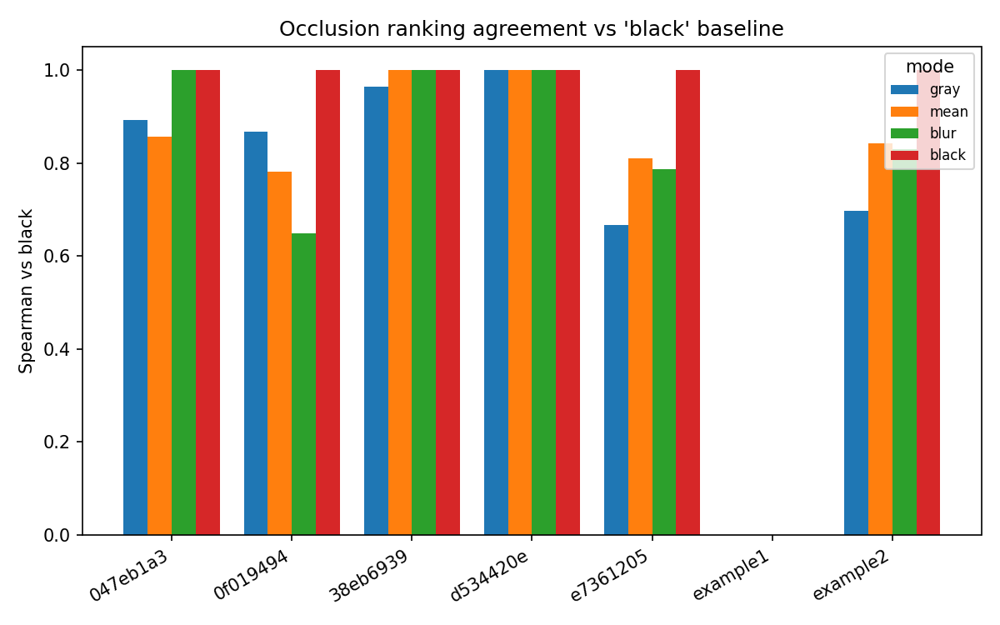
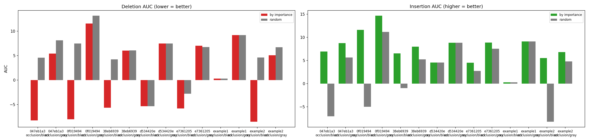

# HPSv3 Perturbation-Attribution Report

Results directory: `xai_24141780`  
Images: **7**  |  Methods: occlusion, LIME  |  Baselines: gray, mean, blur, black

## Overview

| image | prompt | base_reward | n_superpixels |
| --- | --- | --- | --- |
| 38eb6939 | The image captures a romantic scene featuring a couple in a … | 9.109 | 7 |
| example1 | cute chibi anime cartoon fox, smiling wagging tail with a sm… | 10.823 | 1 |
| 0f019494 | Painting of a boy sitting with a puppy. | 15.51 | 10 |
| e7361205 | Asian woman, gray strapless top, hand on chin, white backgro… | 11.182 | 8 |
| 047eb1a3 | Couple enjoys wine on balcony under a full moon. | 9.491 | 7 |
| example2 | cute chibi anime cartoon fox, smiling wagging tail with a sm… | 7.163 | 10 |
| d534420e | The image presents a serene and captivating scene set within… | 9.579 | 2 |

## 1. What the model rewards (per image)

### 38eb6939 — base reward μ = 9.109

Prompt: *The image captures a romantic scene featuring a couple in a passionate embrace. The woman, with auburn hair and fair skin, is reclining on a lavish cream-colored chaise lounge with intricate gilded details. She is wearing a flowing green gown that cascades around her, with shades of blue shimmering *

- Strongest positive region (occlusion/black): **+9.07**
- Fraction of regions that *hurt* the score: **14.3%** (min -0.03)

### example1 — base reward μ = 10.823

Prompt: *cute chibi anime cartoon fox, smiling wagging tail with a small cartoon heart above sticker*

- Strongest positive region (occlusion/black): **+21.12**
- Fraction of regions that *hurt* the score: **0.0%** (min +21.12)

### 0f019494 — base reward μ = 15.510

Prompt: *Painting of a boy sitting with a puppy.*

- Strongest positive region (occlusion/black): **+16.99**
- Fraction of regions that *hurt* the score: **20.0%** (min -0.05)

### e7361205 — base reward μ = 11.182

Prompt: *Asian woman, gray strapless top, hand on chin, white background.*

- Strongest positive region (occlusion/black): **+7.49**
- Fraction of regions that *hurt* the score: **0.0%** (min +0.09)

### 047eb1a3 — base reward μ = 9.491

Prompt: *Couple enjoys wine on balcony under a full moon.*

- Strongest positive region (occlusion/black): **+15.55**
- Fraction of regions that *hurt* the score: **28.6%** (min -0.18)

### example2 — base reward μ = 7.163

Prompt: *cute chibi anime cartoon fox, smiling wagging tail with a small cartoon heart above sticker*

- Strongest positive region (occlusion/black): **+15.01**
- Fraction of regions that *hurt* the score: **30.0%** (min -0.12)

### d534420e — base reward μ = 9.579

Prompt: *The image presents a serene and captivating scene set within a dense forest. A woman, adorned in a striking red gown, sits gracefully amidst the woodland landscape. Her dark hair complements the richness of her dress, and her gaze is directed slightly upwards, as if contemplating the surrounding nat*

- Strongest positive region (occlusion/black): **+19.86**
- Fraction of regions that *hurt* the score: **0.0%** (min +0.04)

## 2. Occlusion vs LIME agreement (cross-method validation)

| image | mode | spearman_occ_vs_lime |
| --- | --- | --- |
| 38eb6939 | gray | 0.964 |
| 38eb6939 | mean | 0.964 |
| 38eb6939 | blur | 1.0 |
| 38eb6939 | black | 1.0 |
| example1 | gray | nan |
| example1 | mean | nan |
| example1 | blur | nan |
| example1 | black | nan |
| 0f019494 | gray | 0.867 |
| 0f019494 | mean | 0.976 |
| 0f019494 | blur | 0.952 |
| 0f019494 | black | 0.903 |
| e7361205 | gray | 0.881 |
| e7361205 | mean | 1.0 |
| e7361205 | blur | 0.833 |
| e7361205 | black | 0.929 |
| 047eb1a3 | gray | 0.964 |
| 047eb1a3 | mean | 1.0 |
| 047eb1a3 | blur | 1.0 |
| 047eb1a3 | black | 0.964 |
| example2 | gray | 0.83 |
| example2 | mean | 0.818 |
| example2 | blur | 0.806 |
| example2 | black | 0.903 |
| d534420e | gray | 1.0 |
| d534420e | mean | 1.0 |
| d534420e | blur | 1.0 |
| d534420e | black | 1.0 |

Mean Spearman = **0.94** (strong). Positive across the board → the two methods localize the same regions.

## 3. Baseline (color-perturbation) sensitivity

| image | mode | spearman_vs_black |
| --- | --- | --- |
| 38eb6939 | gray | 0.964 |
| 38eb6939 | mean | 1.0 |
| 38eb6939 | blur | 1.0 |
| 38eb6939 | black | 1.0 |
| example1 | gray | nan |
| example1 | mean | nan |
| example1 | blur | nan |
| example1 | black | nan |
| 0f019494 | gray | 0.867 |
| 0f019494 | mean | 0.782 |
| 0f019494 | blur | 0.648 |
| 0f019494 | black | 1.0 |
| e7361205 | gray | 0.667 |
| e7361205 | mean | 0.81 |
| e7361205 | blur | 0.786 |
| e7361205 | black | 1.0 |
| 047eb1a3 | gray | 0.893 |
| 047eb1a3 | mean | 0.857 |
| 047eb1a3 | blur | 1.0 |
| 047eb1a3 | black | 1.0 |
| example2 | gray | 0.697 |
| example2 | mean | 0.842 |
| example2 | blur | 0.83 |
| example2 | black | 1.0 |
| d534420e | gray | 1.0 |
| d534420e | mean | 1.0 |
| d534420e | blur | 1.0 |
| d534420e | black | 1.0 |

Mean agreement of soft baselines vs black = **0.87** (strong). Black gives the largest magnitudes; the choice of baseline shifts which regions look most important (the 'missingness' effect) → report multiple baselines.

## 4. Faithfulness (deletion / insertion)

| image | method | mode | deletion_auc | deletion_random | deletion_ok | insertion_auc | insertion_random | insertion_ok |
| --- | --- | --- | --- | --- | --- | --- | --- | --- |
| 047eb1a3 | occlusion | black | -8.2205 | 4.5841 | ✓ | 6.9519 | -7.0584 | ✓ |
| 047eb1a3 | occlusion | gray | 5.4046 | 8.1162 | ✓ | 8.7563 | 5.6356 | ✓ |
| 0f019494 | occlusion | black | -8.0051 | 7.4817 | ✓ | 11.627 | -4.9916 | ✓ |
| 0f019494 | occlusion | gray | 11.5427 | 13.1327 | ✓ | 14.6795 | 11.1689 | ✓ |
| 38eb6939 | occlusion | black | -5.646 | 4.2358 | ✓ | 6.553 | -0.9808 | ✓ |
| 38eb6939 | occlusion | gray | 6.0394 | 6.0462 | ✓ | 7.9778 | 5.2655 | ✓ |
| d534420e | occlusion | black | -5.3175 | -5.3175 | ✗ | 4.5829 | 4.5829 | ✗ |
| d534420e | occlusion | gray | 7.4679 | 7.4679 | ✗ | 8.8317 | 8.8317 | ✗ |
| e7361205 | occlusion | black | -5.79 | -2.7923 | ✓ | 4.5114 | 2.7649 | ✓ |
| e7361205 | occlusion | gray | 7.0098 | 6.7453 | ✗ | 8.8775 | 7.5523 | ✓ |
| example1 | occlusion | black | 0.2982 | 0.2982 | ✗ | 0.2706 | 0.2706 | ✗ |
| example1 | occlusion | gray | 9.1824 | 9.1824 | ✗ | 9.1456 | 9.1456 | ✗ |
| example2 | occlusion | black | -8.4951 | 4.606 | ✓ | 5.5247 | -8.2328 | ✓ |
| example2 | occlusion | gray | 5.0823 | 6.698 | ✓ | 6.8074 | 4.7981 | ✓ |

Insertion passes **10/14**, deletion passes **9/14**. Insertion is the more reliable signal; with soft baselines (gray) the deletion AUC can be inflated by the curve recovering toward the neutral-baseline score — compare the black baseline for a cleaner deletion test.

## 5. Body-part attribution (Sapiens semantic regions)

Aggregated across images using occlusion/black. Semantic parts are comparable across images (unlike SLIC superpixels), so this ranks which body parts drive HPSv3's reward. Area-normalized values divide by the part's pixel share to remove the size confound.

| part | n_images | mean_area_pct | mean_importance | std_importance | imp_per_area |
| --- | --- | --- | --- | --- | --- |
| background | 7 | 86.54 | 14.5759 | 5.4849 | 16.84 |
| face | 5 | 3.42 | 3.5192 | 2.7545 | 102.87 |
| hair | 5 | 4.28 | 2.794 | 1.8917 | 65.28 |
| upper_clothing | 5 | 3.81 | 1.4631 | 1.055 | 38.39 |
| hands | 4 | 1.59 | 1.2307 | 1.2763 | 77.48 |
| legs | 2 | 1.27 | 1.0543 | 0.8202 | 83.29 |
| torso | 3 | 1.49 | 1.0205 | 1.5328 | 68.51 |
| arms | 5 | 3.33 | 0.7564 | 1.0319 | 22.69 |
| feet | 4 | 1.04 | 0.3872 | 0.4634 | 37.28 |
| lower_clothing | 5 | 0.5 | 0.196 | 0.3277 | 39.01 |

*Raw `mean_importance` is size-confounded (background covers ~87% of the image, so occluding it changes the most pixels). `imp_per_area` (reward drop ÷ area fraction) is the fair semantic measure; it is unreliable for parts <2% area.*

Most reward-dense parts (importance per unit area): **face (103), hair (65), upper_clothing (38)**.

## 6. Limitations

- Sample size: **7 images** — illustrative, not statistically general.

- All images are high-scoring; no low-quality contrast case.

- LIME has sampling noise; check stability across seeds before strong claims.
