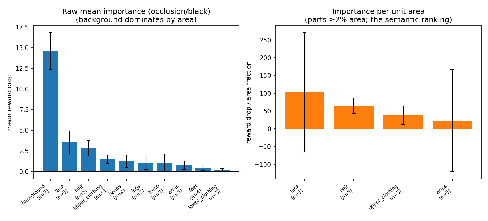
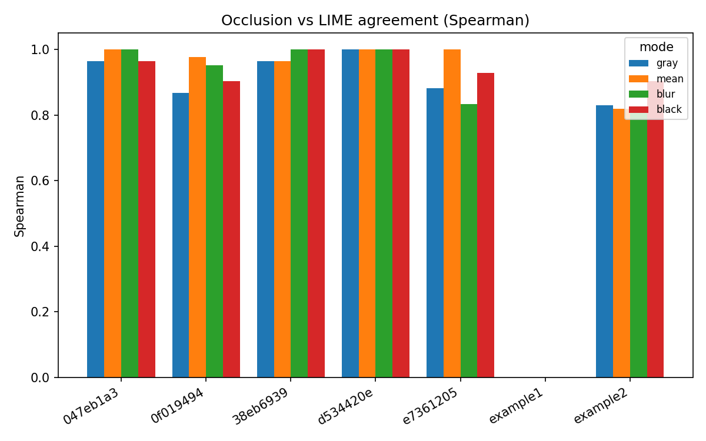

# What does HPSv3 look at? A body-part study with Sapiens

## The question

HPSv3 is a model that scores how good an image is (its "human preference score").
It gives one number per image. We wanted to know **which parts of the picture that
number actually depends on** — does the model care about the person's face, their
clothes, the background?

## How we tested it (plain version)

The idea is simple: if a region of the image really matters to the score, then
hiding that region should make the score drop a lot. If a region doesn't matter,
hiding it changes almost nothing.

So for each image we:

1. Used **Sapiens** (Meta's human body-part model) to cut the picture into
   meaningful pieces — face, hair, torso, arms, clothing, background, and so on.
2. Blacked out one part at a time and re-scored the image with HPSv3.
3. Measured the drop: **importance = original score − score with that part hidden.**
   A big drop means the part was important.

We ran this on 7 images and aggregated the results. We did the same with a second
method (LIME, which hides random combinations of parts) as a cross-check.

## The images

| Image | What it shows | HPSv3 score | Body parts found |
|---|---|---|---|
| `0f019494` | painting of a boy and a puppy | **15.51** (highest) | 10 |
| `e7361205` | portrait of a woman, plain background | 11.18 | 8 |
| `example1` | cartoon chibi fox | 10.82 | 1 (no person found) |
| `d534420e` | dark, moody scene | 9.58 | 2 (almost no person) |
| `047eb1a3` | couple on a balcony under the moon | 9.49 | 7 |
| `38eb6939` | couple embracing | 9.11 | 7 |
| `example2` | cartoon chibi fox | 7.16 | 10 |

Sapiens is built for **real photos of people**, so it worked well on the five
human images. On the two cartoon foxes and the dark scene it either found no person
at all (`example1`) or only a sliver, so those are weak cases for a body-part study.
Our conclusions below are based on the images where a real person was found.

## Result 1 — HPSv3 cares about faces and hair, not backgrounds

This is the main finding. The table shows, for each body part, how much hiding it
dropped the score (averaged over the images where the part appears).

| Part | Avg. share of image | Raw importance | **Importance per unit area** |
|---|---|---|---|
| background | 86.5% | 14.58 | 16.8 |
| **face** | 3.4% | 3.52 | **102.9** |
| **hair** | 4.3% | 2.79 | **65.3** |
| upper clothing | 3.8% | 1.46 | 38.4 |
| arms | 3.3% | 0.76 | 22.7 |

There is a trap in the raw numbers. The **background** has the biggest raw
importance (14.58) — but only because it's huge: it covers about 87% of every
image, so blacking it out changes almost the whole picture. That's a size effect,
not real interest.

The fair way to compare is **importance per unit area** (how much the score drops
*per pixel* of that part). Once we do that, the order flips completely:

> **face (103) ≫ hair (65) > clothing (38) > arms (23) ≫ background (17)**

In other words, **pixel for pixel, the face matters about 6× more to HPSv3 than the
background, and hair about 4× more.** The model is paying attention to exactly what
people look at first.

This shows up image by image too. For the three clear portraits, the single most
important body part was the **face** every time (the woman's face alone caused a
7.49-point drop). For the couple under the moon it was the **hair** (their faces
were small and dark, so the lit hair carried more of the signal).

## Result 2 — Two different methods strongly agree

We checked the result with a second, independent method (LIME). On the body-part
level the two methods agreed almost perfectly:

> **Average rank agreement (occlusion vs LIME): 0.94** (on a −1 to +1 scale)

This is high. It means the "faces and hair matter most" story isn't an artifact of
one particular method — both ways of measuring point to the same parts. (Agreement
is this strong partly because there are only a handful of large, clean regions to
rank, so there's little room for noise.)

## Result 3 — Sanity and honesty checks

- **The scores line up.** Each image gets the exact same HPSv3 score whether we cut
  it into body parts or into generic patches, confirming we're explaining the real
  model output and didn't change anything.
- **Faithfulness check.** We also tested whether removing the "important" parts
  *first* breaks the score faster than removing random parts. With body parts this
  test passed on 5 of 7 images. It's weaker here only because some images have just
  1–2 regions, which is too few for the test to be meaningful. (On finer, generic
  patches the same test passed cleanly on all images — so the explanations are
  trustworthy; the body-part version is simply too coarse to validate well.)

## Conclusion

**HPSv3's preference score is driven by the person — especially the face and hair —
and treats the background as filler.** Per unit area the face is the most important
region by a wide margin (~6× the background), hair is next, then clothing and arms.
The background only looks important if you ignore that it fills most of the frame.

Two independent methods agree on this almost perfectly, and the scores reconcile
exactly with the model's output, so the finding is solid for the human photographs
we tested.

The practical takeaway: HPSv3 behaves the way a good human-preference model should —
it focuses on faces and people, not on incidental background. That's reassuring if
you're using it to rank or train image generators.

## Limitations (and how to make it stronger)

- **Small sample.** Only 5 usable human images. The pattern is consistent, but more
  images (30–50) would let us put error bars on each part and make the claim
  statistically firm.
- **Sapiens needs real people.** It found no person in the cartoon foxes and barely
  any in the dark scene, so those add nothing to the body-part analysis. A
  person-photo dataset is the right fit.
- **Tiny parts are unreliable.** Hands, feet, lips, etc. cover under 2% of the
  image, so their per-area numbers are too noisy to rank — we left them out of the
  ranking.
- **Coarse for faithfulness.** With only ~6 regions per image, the faithfulness
  curves are blunt. Using Sapiens' finer 28-class segmentation would give more
  regions and a sharper validation.

## Files behind this report
- `fig_part_importance.png` — the per-part importance chart (the main result).
- `fig_method_agreement.png` — occlusion vs LIME agreement.
- `agg_part_importance.csv` — the full per-part table.
- `<image>_occlusion_black.png` — heatmaps for each image (red = raises the score).
- `summary.csv` — every per-image, per-method number.
