# HPSv3 Perturbation-Attribution Report

Results directory: `xai_24160871`  
Images: **91**  |  Methods: occlusion, LIME  |  Baselines: gray, mean, blur, black

## Overview

| image | prompt | base_reward | n_superpixels |
| --- | --- | --- | --- |
| 66ea2468 | Here's a description of the image:

The image is a portrait … | 6.597 | 1 |
| 89b64556 | A couple hugs affectionately in a bright, modern room. | 14.881 | 7 |
| f266ed95 | Neon palm tree and geometric shapes illuminate a dark space. | 8.515 | 5 |
| 183f3c78 | The photograph presents a close-up, profile view of a black … | 9.303 | 6 |
| 38db7466 | The image presents a portrait of a smiling young woman again… | 11.125 | 8 |
| 92c51da3 | Black bird perches on branch over water, looking left. | 8.157 | 8 |
| b99bec61 | A cozy portrait shows a family: mother, father, and daughter… | 13.947 | 6 |
| 0dd86fcb | Woman with headphones sits cross-legged on an ornate bench. | 14.036 | 10 |
| 7908ec90 | The image captures a young couple standing close together in… | 12.11 | 8 |
| 002210b7 | The image features a man dressed in a red racing suit agains… | 12.682 | 7 |
| 9c35db4f | Smiling woman in black pants sits in a salon chair. | 7.77 | 8 |
| a53e4ccc | The image depicts a towering and intricately decorated build… | 11.667 | 2 |
| dae811d1 | The image depicts a detailed stone carving of a lion's head … | 7.572 | 1 |
| 047eb1a3 | Couple enjoys wine on balcony under a full moon. | 9.491 | 7 |
| 7d26c82f | A couple having a picnic in a park. Man is laying down takin… | 14.603 | 8 |
| f9aeaa10 | Painting of a woman in a flowing red dress dancing. | 14.075 | 9 |
| 0ad54dec | Girl in white dress and hat sits in garden. | 10.422 | 9 |
| 671140d7 | Close-up of a dark red rose in full bloom. | 15.649 | 1 |
| 9978f229 | The image shows a romantic scene in what appears to be Venic… | 8.723 | 10 |
| 3a64ad19 | This is a detailed portrait painting of a young woman from t… | 4.046 | 3 |
| b0f5e1c4 | In this photo, a woman has her back to the camera and is per… | 6.891 | 6 |
| 014fafe5 | The image captures a scenic view of Berlin, dominated by the… | 8.508 | 4 |
| 5fcc7c2c | Man running on a path, wearing a yellow jacket. | 15.253 | 9 |
| e0644a38 | Here's a description of the image:

The image depicts a youn… | 11.212 | 5 |
| 9b1cb600 | This charming illustration exudes warmth and holiday spirit.… | 9.18 | 5 |
| bc6d4f34 | The image captures a serene moment with a beautiful orange a… | 8.944 | 1 |
| a0eb9910 | The image features a young Asian woman in a striking pose, s… | 12.198 | 9 |
| 9f4bb4c7 | The image captures a stunning fireworks display over a body … | 7.856 | 2 |
| 6ca521c2 | The image depicts a highly detailed and realistic scene wher… | 13.81 | 8 |
| 1d641fa8 | Asian woman enjoying tea outside sitting on a beach chair. | 11.336 | 10 |
| 5690f96f | Captured in a high-angle medium shot, a young man perches th… | 9.878 | 7 |
| d7b6be10 | The image features a whimsical and slightly surreal scene. I… | 9.716 | 6 |
| 91d4170f | Climber takes selfie on rocky, foggy mountain peak. | 14.486 | 4 |
| d977f847 | Two barn swallows sit perched on a white wire. | 14.463 | 9 |
| a27a1723 | The image showcases a tranquil, picturesque view of a Europe… | 11.716 | 1 |
| 7f1e1680 | The painting depicts a detailed watercolor scene featuring a… | 10.232 | 1 |
| 73f5615f | The image captures a serene moment with a beautiful orange a… | 6.163 | 1 |
| 18bca469 | Smiling blonde woman in white shirt and black skirt. | 10.866 | 8 |
| 5e5334ce | Brown cow lies in a grassy field, another in background. | 6.463 | 1 |
| f81c7de4 | Hand touches water, creating magic and light. | 11.741 | 2 |
| 5504eb69 | The image features a young Asian woman in professional attir… | 11.592 | 8 |
| 4cb1d9fb | The image shows two fit, athletic women taking a break from … | 12.109 | 10 |
| bce06b44 | Certainly! Here's a detailed description of the image:

The … | 10.933 | 5 |
| f6d77bd5 | Women enjoy cocktails and food at a social gathering. | 14.016 | 9 |
| 5ea2567e | Painted woman walks with flower-filled bicycle on a sun-dapp… | 10.271 | 9 |
| 0bf6d055 | Smiling young man and woman sitting on a fence. | 15.08 | 9 |
| 07333fd0 | Here's a description of the image:

The image depicts a youn… | 9.502 | 7 |
| 5e89d09b | Couple skateboarding on road. | 10.735 | 8 |
| 14d6bb54 | The image is a stylized illustration of a woman walking her … | 7.643 | 10 |
| 56130b57 | Smiling woman in black pants sits in a salon chair. | 13.086 | 9 |
| 2f466312 | A nude-shaped candle burns atop a rustic wooden slice with g… | 12.459 | 1 |
| 7a09cfa0 | The image captures a whimsical moment with two women standin… | 7.783 | 8 |
| 0748f1b0 | Certainly! Here is a detailed description of the image:

The… | 6.321 | 1 |
| db4f6c51 | Certainly, let's describe the image.

The image showcases a … | 12.637 | 6 |
| 06842ff3 | Certainly! Here's a description of the image:

The image fea… | 9.589 | 1 |
| 74d745bf | Illuminated building at night with blurred light trails on t… | 12.535 | 2 |
| a57a9e5c | Asian man in boxing stance, wearing red gloves and shorts. | 8.214 | 10 |
| 6d1e9865 | The image captures a romantic scene featuring a couple in a … | 9.138 | 7 |
| 25e406d3 | Newlyweds embrace beside a pool, lush foliage behind. | 10.396 | 8 |
| cefb4080 | The aerial shot presents a serene, winding river bordered by… | 9.022 | 1 |
| c4da57ac | The image is a digitally created, stylized representation of… | 7.561 | 7 |
| b998a060 | Black and white cat stretches on a tiled patio. | 7.826 | 8 |
| 92415a1a | The image is a vintage-style barbershop illustration, remini… | 12.964 | 6 |
| eaa351af | A large, white stone archway stands tall against a clear blu… | 6.682 | 2 |
| cc2fbd21 | Captured in a high-angle medium shot, a young man perches th… | 11.478 | 9 |
| 3040b049 | In a studio portrait, a young professional-looking African-A… | 11.707 | 9 |
| 5582d290 | The image is an artistic illustration featuring a surreal an… | 9.332 | 2 |
| 60f602ac | The image presents a serene and captivating scene set within… | 9.283 | 3 |
| 927d556f | The image is a digitally painted scene of a black and white … | 9.195 | 2 |
| 601dfdf2 | Woman meditates on a dock over water, reflection visible. | 4.36 | 9 |
| 8d11ee8a | The photograph showcases an elegantly dressed elderly couple… | 14.415 | 6 |
| 7c94b234 | Abstract art featuring swirling blues, purples, and whites w… | 14.698 | 1 |
| 647383a5 | The image captures a moment of pure joy as a young girl runs… | 8.287 | 10 |
| 8b8f0909 | The image captures a young man walking down a narrow city st… | 13.957 | 7 |
| fc641478 | Sunlit birch trees stand out in a dark forest. | 11.936 | 1 |
| 1a42e12b | Black Converse sneakers sit on a rocky beach by the water. | 10.299 | 4 |
| e0d29681 | Watercolor painting of a window with red flowers. | 14.19 | 1 |
| ae9889bf | Woman squats stylishly before futuristic architecture. | 8.168 | 10 |
| ead82a7e | The image showcases a delicate, light pink rose in full bloo… | 9.454 | 3 |
| d8403139 | The image captures a moment of relaxation and connection wit… | 9.922 | 6 |
| 001c2723 | This image captures the interior of a lavishly decorated bui… | 10.486 | 1 |
| d0f0787a | Four American football players in uniform stand on the field… | 11.466 | 10 |
| 4ebe4ec3 | Snowy forest filled with tall, thin trees. | 12.331 | 1 |
| 577d09f9 | Monochrome portrait of a woman sitting cross-legged. | 7.833 | 10 |
| 41003c46 | Smiling woman in pink shirt and denim jacket. | 6.202 | 7 |
| 1c522730 | Sunset illuminates rocks, flowers, and deer in a hilly meado… | 12.095 | 5 |
| 023667bc | Black Converse sneakers sit on a rocky beach by the water. | 11.951 | 6 |
| ebc78d2e | Sweaty, muscular woman in sports bra stands in gym, hands on… | 15.704 | 8 |
| ef87eebb | The image captures a close-up of a dog's head, viewed from a… | 12.495 | 4 |
| 0c217725 | The image captures a vibrant outdoor scene where a series of… | 7.935 | 6 |
| 9a1a949a | The image presents a close-up, dramatic portrait of a young … | 12.054 | 4 |

## 1. What the model rewards (per image)

### 66ea2468 — base reward μ = 6.597

Prompt: *Here's a description of the image:

The image is a portrait of a small, white fluffy dog, possibly a Pomeranian or a similar breed. The dog is standing on a bright yellow surface, likely a table or platform. It is looking upwards and slightly to the left, with a soft, endearing expression. 

The dog*

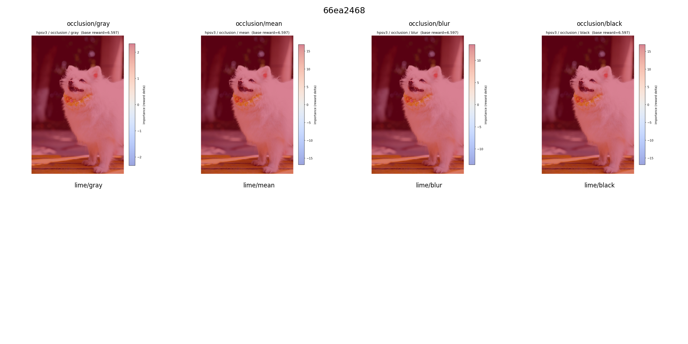

- Strongest positive region (occlusion/black): **+16.90**
- Fraction of regions that *hurt* the score: **0.0%** (min +16.90)

### 89b64556 — base reward μ = 14.881

Prompt: *A couple hugs affectionately in a bright, modern room.*

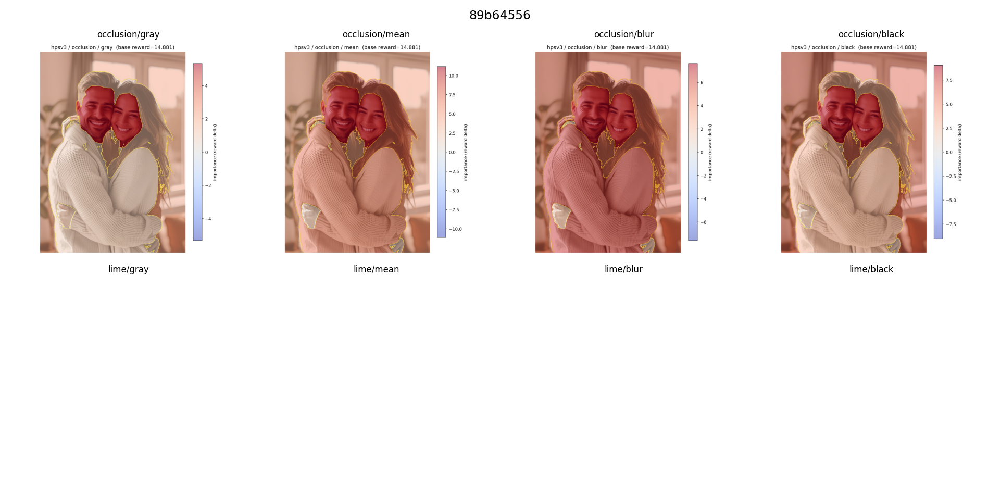

- Strongest positive region (occlusion/black): **+9.03**
- Fraction of regions that *hurt* the score: **14.3%** (min -0.04)

### f266ed95 — base reward μ = 8.515

Prompt: *Neon palm tree and geometric shapes illuminate a dark space.*

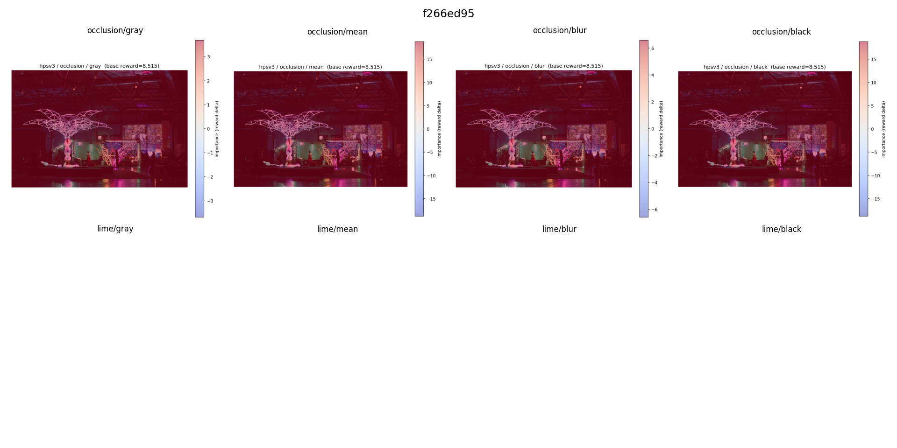

- Strongest positive region (occlusion/black): **+18.77**
- Fraction of regions that *hurt* the score: **0.0%** (min +0.00)

### 183f3c78 — base reward μ = 9.303

Prompt: *The photograph presents a close-up, profile view of a black and white cat. The focus is sharp on the cat's face, highlighting the texture of its fur and the details of its eye. 

The cat's fur is predominantly white, with a dense patch of black fur covering the top of its head and surrounding its ey*

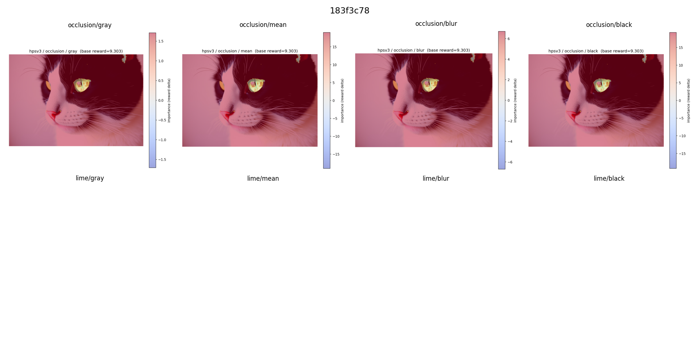

- Strongest positive region (occlusion/black): **+19.25**
- Fraction of regions that *hurt* the score: **16.7%** (min -0.31)

### 38db7466 — base reward μ = 11.125

Prompt: *The image presents a portrait of a smiling young woman against a vibrant blue background. She is fair-skinned with short, neat hair and is positioned in the center of the frame, her body facing forward. Her arms are raised and bent, with her hands resting behind her head, creating a relaxed and casu*

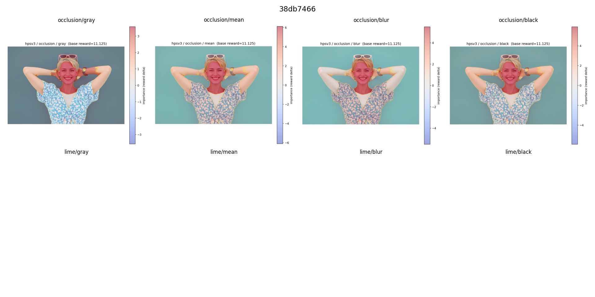

- Strongest positive region (occlusion/black): **+5.92**
- Fraction of regions that *hurt* the score: **12.5%** (min -0.02)

### 92c51da3 — base reward μ = 8.157

Prompt: *Black bird perches on branch over water, looking left.*

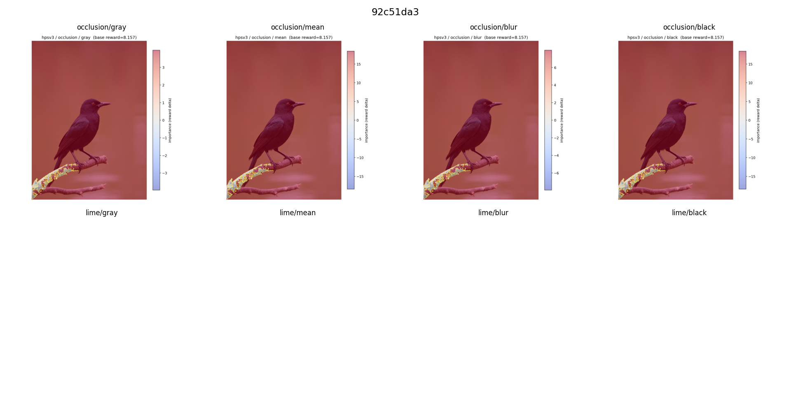

- Strongest positive region (occlusion/black): **+18.42**
- Fraction of regions that *hurt* the score: **37.5%** (min -0.13)

### b99bec61 — base reward μ = 13.947

Prompt: *A cozy portrait shows a family: mother, father, and daughter. The daughter hugs her father around the neck while the mother embraces them both. They wear casual sweaters.*

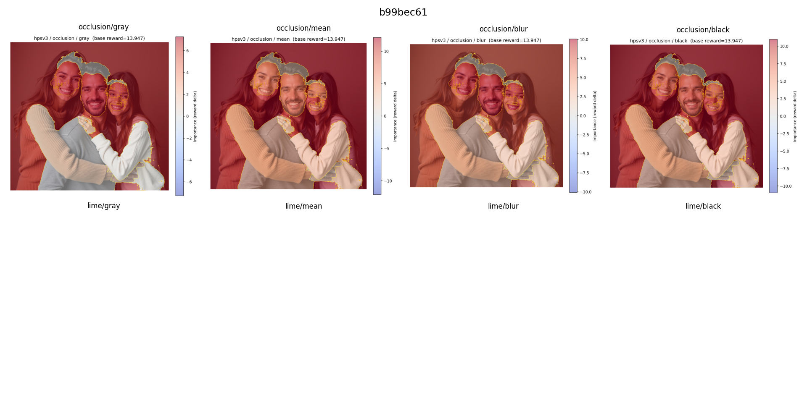

- Strongest positive region (occlusion/black): **+10.99**
- Fraction of regions that *hurt* the score: **16.7%** (min -0.01)

### 0dd86fcb — base reward μ = 14.036

Prompt: *Woman with headphones sits cross-legged on an ornate bench.*

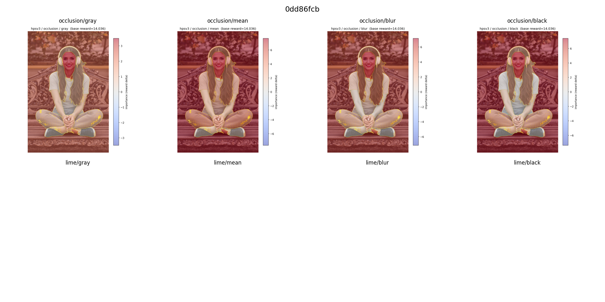

- Strongest positive region (occlusion/black): **+7.39**
- Fraction of regions that *hurt* the score: **10.0%** (min -0.50)

### 7908ec90 — base reward μ = 12.110

Prompt: *The image captures a young couple standing close together in what appears to be a kitchen. The woman, with her long brown hair partially pulled back, is dressed in a light blue top and a white button-down shirt. She is holding up one of her fingers, perhaps showcasing something she has just tasted o*

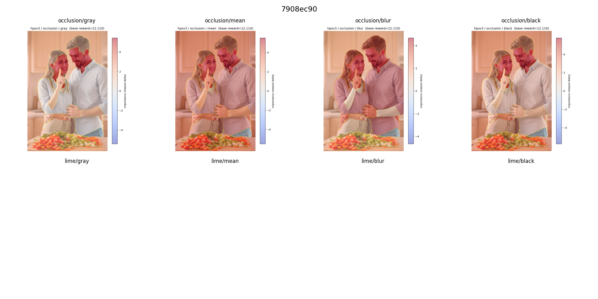

- Strongest positive region (occlusion/black): **+5.77**
- Fraction of regions that *hurt* the score: **12.5%** (min -0.18)

### 002210b7 — base reward μ = 12.682

Prompt: *The image features a man dressed in a red racing suit against a solid black background. The suit, a vibrant shade of red, has a simple, classic design with long sleeves and pants, accented with white piping details along the collar and shoulder seams. The man is holding a racing helmet in his left h*

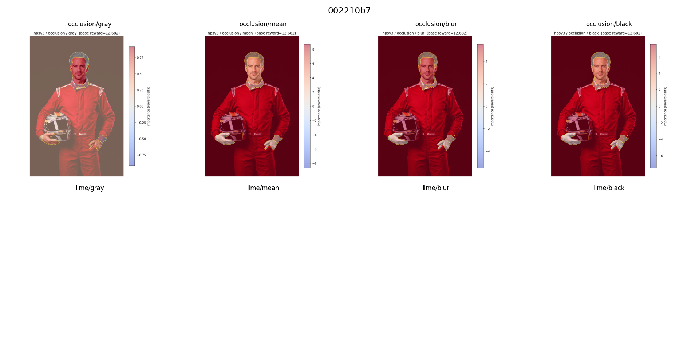

- Strongest positive region (occlusion/black): **+7.52**
- Fraction of regions that *hurt* the score: **0.0%** (min +0.02)

### 9c35db4f — base reward μ = 7.770

Prompt: *Smiling woman in black pants sits in a salon chair.*

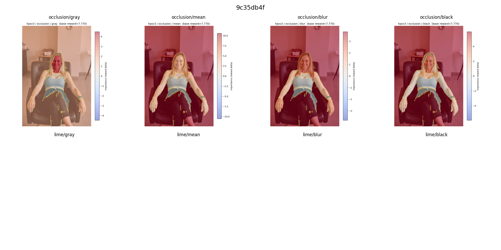

- Strongest positive region (occlusion/black): **+5.97**
- Fraction of regions that *hurt* the score: **12.5%** (min -0.03)

### a53e4ccc — base reward μ = 11.667

Prompt: *The image depicts a towering and intricately decorated building with a light brown color that almost appears orange, resembling either a castle or a grand hotel. The structure has multiple floors, each adorned with complex patterns and numerous windows. The windows are framed in dark brown, some of *

- Strongest positive region (occlusion/black): **+21.92**
- Fraction of regions that *hurt* the score: **0.0%** (min +0.00)

### dae811d1 — base reward μ = 7.572

Prompt: *The image depicts a detailed stone carving of a lion's head prominently displayed on a light brown, textured wall. The lion’s face, complete with its mane and ears, has been intricately carved and appears to be made from a lighter colored stone, possibly marble or granite, creating a striking contra*

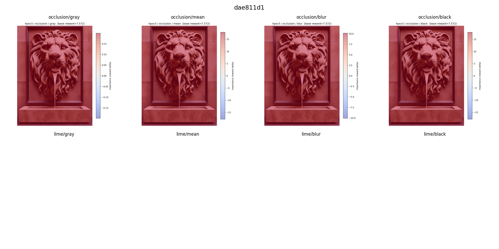

- Strongest positive region (occlusion/black): **+17.87**
- Fraction of regions that *hurt* the score: **0.0%** (min +17.87)

### 047eb1a3 — base reward μ = 9.491

Prompt: *Couple enjoys wine on balcony under a full moon.*

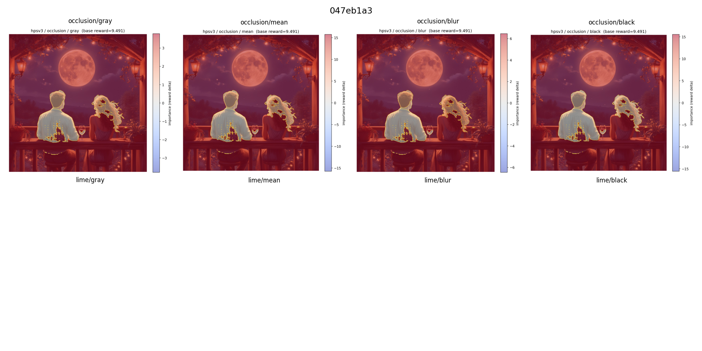

- Strongest positive region (occlusion/black): **+15.55**
- Fraction of regions that *hurt* the score: **28.6%** (min -0.18)

### 7d26c82f — base reward μ = 14.603

Prompt: *A couple having a picnic in a park. Man is laying down taking a picture.*

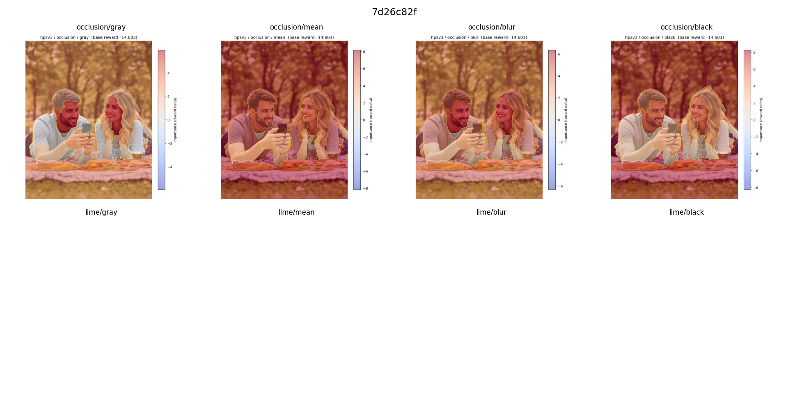

- Strongest positive region (occlusion/black): **+8.24**
- Fraction of regions that *hurt* the score: **25.0%** (min -0.23)

### f9aeaa10 — base reward μ = 14.075

Prompt: *Painting of a woman in a flowing red dress dancing.*

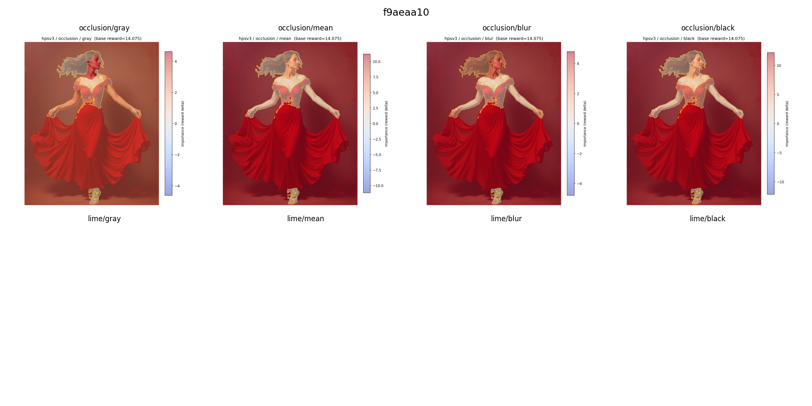

- Strongest positive region (occlusion/black): **+12.18**
- Fraction of regions that *hurt* the score: **0.0%** (min +0.25)

### 0ad54dec — base reward μ = 10.422

Prompt: *Girl in white dress and hat sits in garden.*

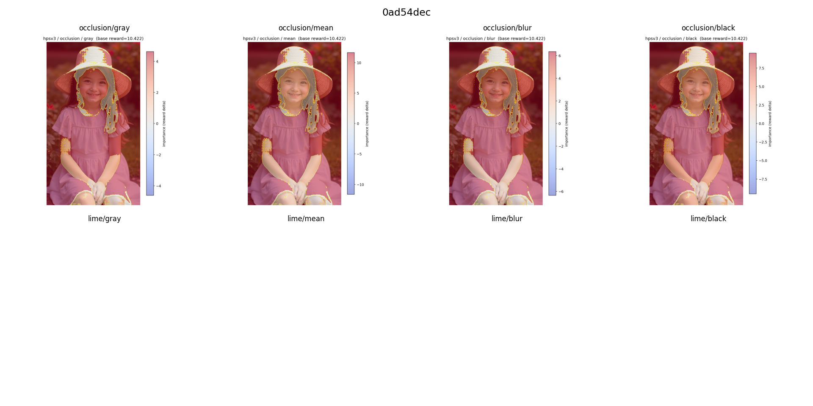

- Strongest positive region (occlusion/black): **+9.51**
- Fraction of regions that *hurt* the score: **0.0%** (min +0.73)

### 671140d7 — base reward μ = 15.649

Prompt: *Close-up of a dark red rose in full bloom.*

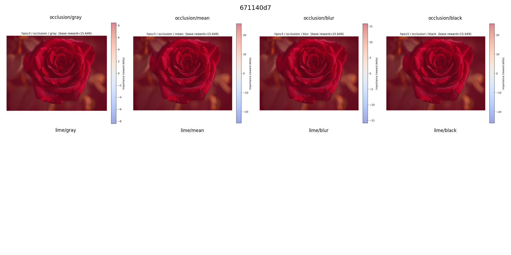

- Strongest positive region (occlusion/black): **+25.87**
- Fraction of regions that *hurt* the score: **0.0%** (min +25.87)

### 9978f229 — base reward μ = 8.723

Prompt: *The image shows a romantic scene in what appears to be Venice, Italy. A couple, a man and a woman, are standing on a bridge, embraced. The woman is leaning against the bridge's stone railing, gazing up at the man. She has curly dark hair and is wearing a fitted red top and black pants. The man is lo*

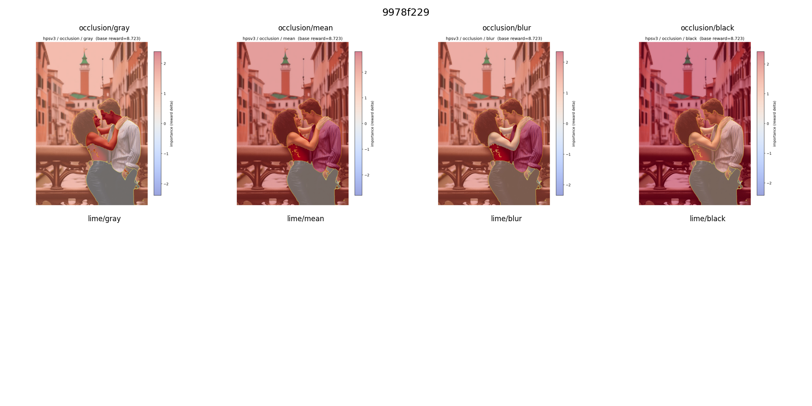

- Strongest positive region (occlusion/black): **+2.42**
- Fraction of regions that *hurt* the score: **10.0%** (min -0.03)

### 3a64ad19 — base reward μ = 4.046

Prompt: *This is a detailed portrait painting of a young woman from the 17th or 18th century, with a completely black background. The pale-skinned woman has short, curly red hair adorned with a white bow. She has striking blue eyes and a smiling face. She wears a complex blue gown embellished with intricate *

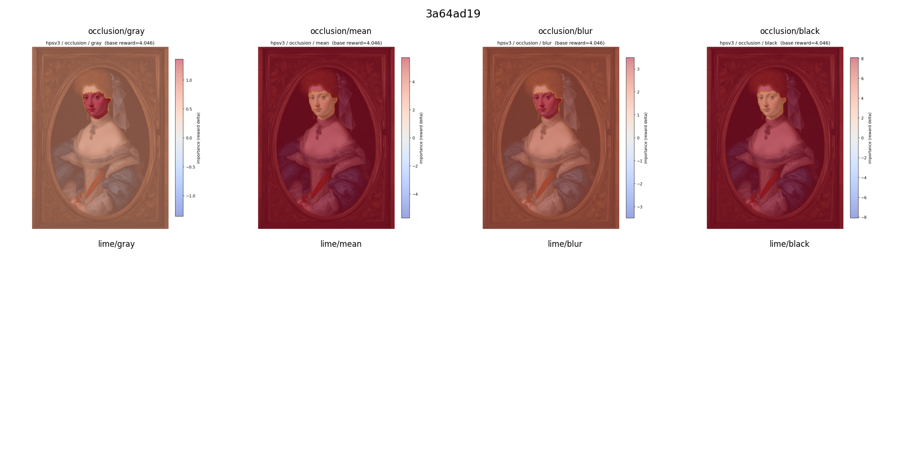

- Strongest positive region (occlusion/black): **+8.09**
- Fraction of regions that *hurt* the score: **0.0%** (min +0.04)

### b0f5e1c4 — base reward μ = 6.891

Prompt: *In this photo, a woman has her back to the camera and is performing a yoga pose on a gray brick floor. She is wearing a black, short-sleeved lace top and brown ballet flats. Her legs are stretched straight up with her ankles crossed, and her arms are also extended upwards, with her hands placed on h*

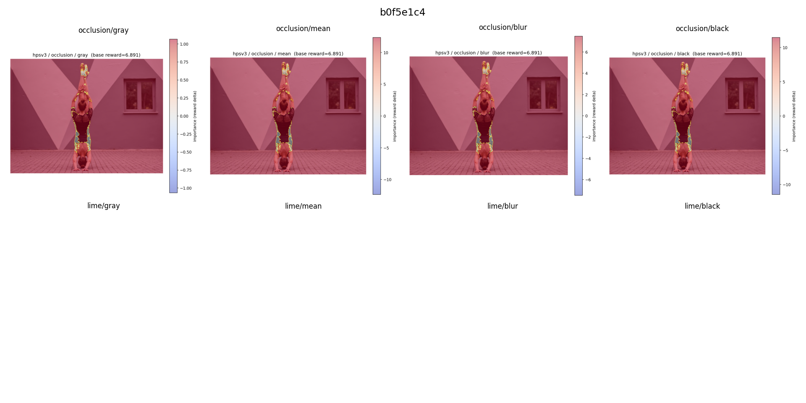

- Strongest positive region (occlusion/black): **+11.46**
- Fraction of regions that *hurt* the score: **50.0%** (min -0.15)

### 014fafe5 — base reward μ = 8.508

Prompt: *The image captures a scenic view of Berlin, dominated by the iconic Berliner Fernsehturm, or Berlin TV Tower. The tower's distinctive design is emphasized, with its spherical observation deck atop a slender concrete shaft and a striking red and white striped antenna extending upwards.

The tower ris*

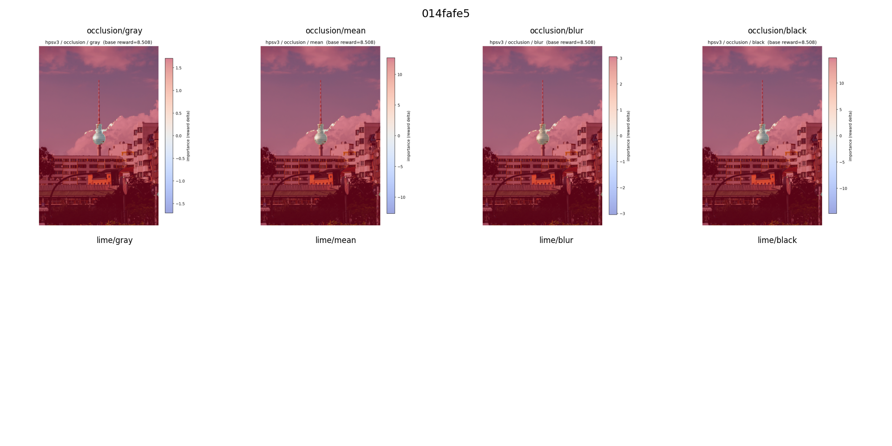

- Strongest positive region (occlusion/black): **+14.82**
- Fraction of regions that *hurt* the score: **25.0%** (min -0.03)

### 5fcc7c2c — base reward μ = 15.253

Prompt: *Man running on a path, wearing a yellow jacket.*

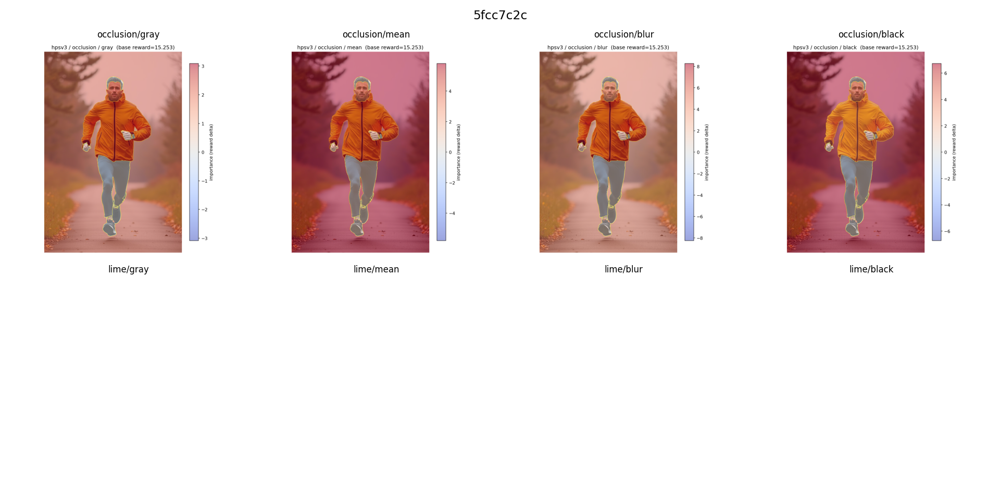

- Strongest positive region (occlusion/black): **+6.72**
- Fraction of regions that *hurt* the score: **11.1%** (min -0.01)

### e0644a38 — base reward μ = 11.212

Prompt: *Here's a description of the image:

The image depicts a young woman with striking blue eyes and pastel-colored hair, styled in pigtails with white fluffy accessories, reminiscent of cat ears. Her hair is dyed with shades of blonde, pink, and lavender. She is positioned in what appears to be a retro *

- Strongest positive region (occlusion/black): **+15.60**
- Fraction of regions that *hurt* the score: **20.0%** (min -0.07)

### 9b1cb600 — base reward μ = 9.180

Prompt: *This charming illustration exudes warmth and holiday spirit. It features two adorable bunny rabbits snuggled close together on a plush, yellow-patterned cushion with green frilled edges. They are engrossed in a book, its pages open to reveal festive illustrations inside. 

The rabbits are dressed in*

- Strongest positive region (occlusion/black): **+19.33**
- Fraction of regions that *hurt* the score: **80.0%** (min -0.09)

### bc6d4f34 — base reward μ = 8.944

Prompt: *The image captures a serene moment with a beautiful orange and white cat. It's lying comfortably on a concrete step, basking in what seems like warm sunlight. The cat's eyes are closed, and its expression suggests contentment and relaxation.

The cat's fur is a mix of light orange and white patches,*

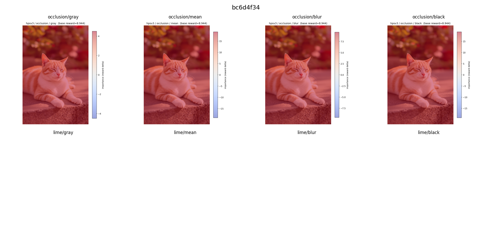

- Strongest positive region (occlusion/black): **+19.22**
- Fraction of regions that *hurt* the score: **0.0%** (min +19.22)

### a0eb9910 — base reward μ = 12.198

Prompt: *The image features a young Asian woman in a striking pose, set against a vivid red backdrop. The woman is dressed in a modern, form-fitting red dress with a high collar and a slit on the side. The long sleeves extend to her mid-arm, leaving her shoulders bare. In her hand, she holds a closed red fan*

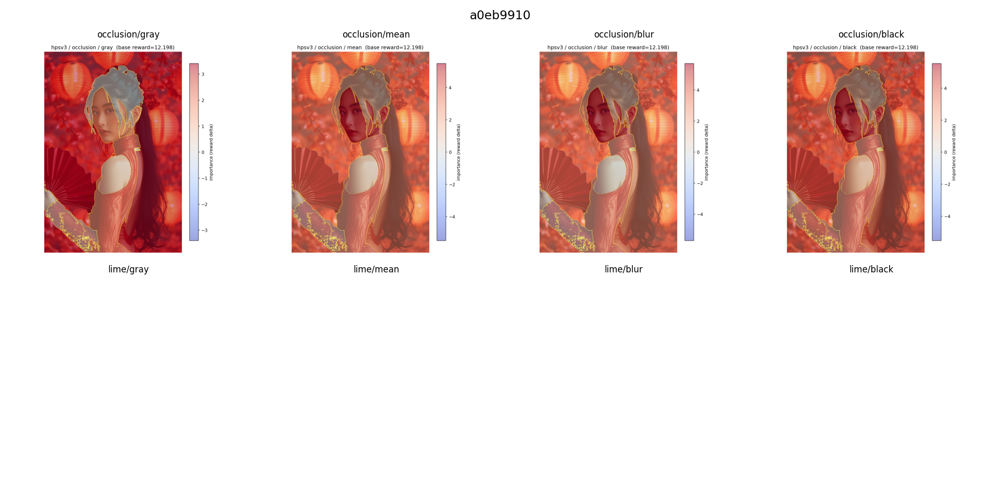

- Strongest positive region (occlusion/black): **+5.54**
- Fraction of regions that *hurt* the score: **11.1%** (min -0.03)

### 9f4bb4c7 — base reward μ = 7.856

Prompt: *The image captures a stunning fireworks display over a body of water at night. The sky is a deep, saturated purple, against which the fireworks burst in a brilliant display of white and pink. The fireworks appear to be of a "palm" type, with numerous trails extending outwards and downwards.

In the *

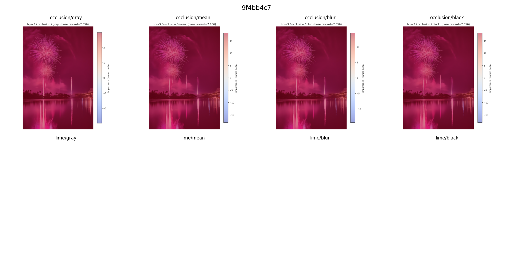

- Strongest positive region (occlusion/black): **+18.10**
- Fraction of regions that *hurt* the score: **0.0%** (min +0.06)

### 6ca521c2 — base reward μ = 13.810

Prompt: *The image depicts a highly detailed and realistic scene where a soldier is walking away from the camera across a wooden plank bridge. The soldier is dressed in a brown uniform, wearing a brown helmet, and carrying a backpack. In his left hand, he holds a water bottle and a small box, possibly a lunc*

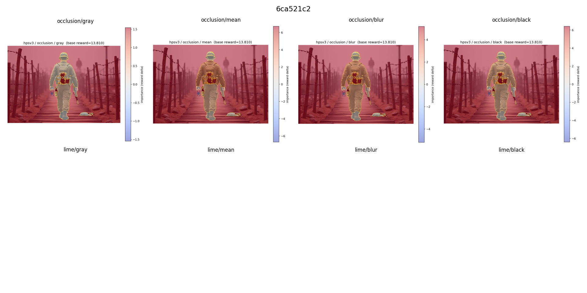

- Strongest positive region (occlusion/black): **+6.41**
- Fraction of regions that *hurt* the score: **12.5%** (min -0.01)

### 1d641fa8 — base reward μ = 11.336

Prompt: *Asian woman enjoying tea outside sitting on a beach chair.*

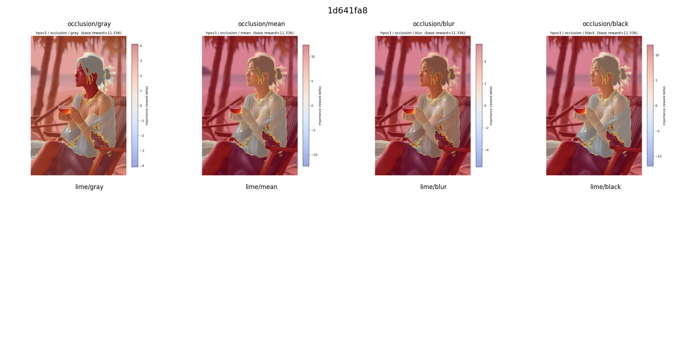

- Strongest positive region (occlusion/black): **+11.96**
- Fraction of regions that *hurt* the score: **0.0%** (min +0.01)

### 5690f96f — base reward μ = 9.878

Prompt: *Captured in a high-angle medium shot, a young man perches thoughtfully atop a craggy, reddish-brown rock formation. He is turned towards the left side of the frame, gazing into the distance with a contemplative expression.

The man is dressed in a casual, modern style. A dark-colored baseball cap si*

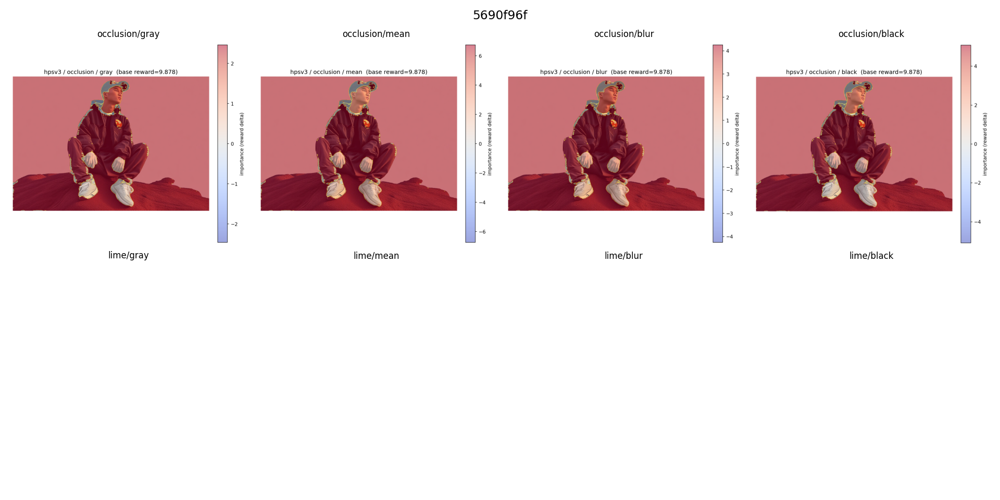

- Strongest positive region (occlusion/black): **+5.08**
- Fraction of regions that *hurt* the score: **14.3%** (min -0.14)

### d7b6be10 — base reward μ = 9.716

Prompt: *The image features a whimsical and slightly surreal scene. In the foreground, a white husky dog peers out from what appears to be the basket of a hot air balloon. The dog has a friendly, slightly goofy expression with its tongue slightly visible, and its paws rest on the edge of the basket.

Above t*

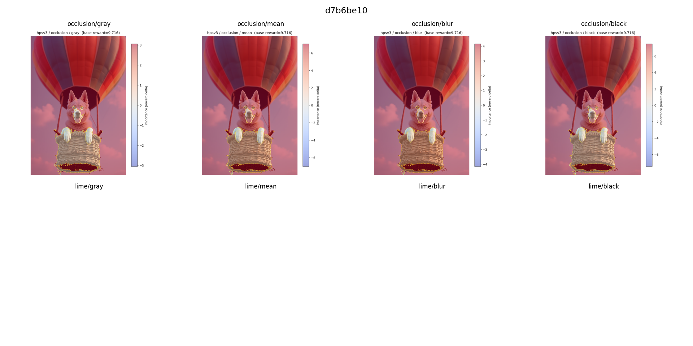

- Strongest positive region (occlusion/black): **+7.47**
- Fraction of regions that *hurt* the score: **0.0%** (min +0.09)

### 91d4170f — base reward μ = 14.486

Prompt: *Climber takes selfie on rocky, foggy mountain peak.*

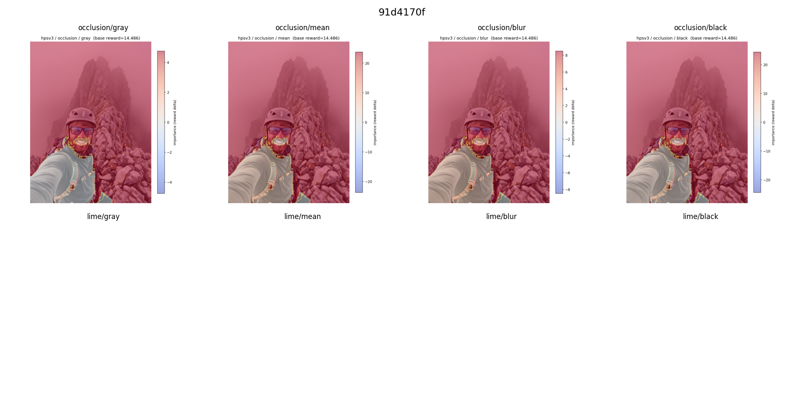

- Strongest positive region (occlusion/black): **+24.38**
- Fraction of regions that *hurt* the score: **0.0%** (min +0.04)

### d977f847 — base reward μ = 14.463

Prompt: *Two barn swallows sit perched on a white wire.*

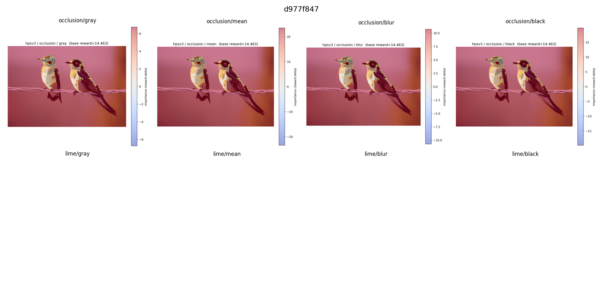

- Strongest positive region (occlusion/black): **+19.86**
- Fraction of regions that *hurt* the score: **22.2%** (min -0.01)

### a27a1723 — base reward μ = 11.716

Prompt: *The image showcases a tranquil, picturesque view of a European village nestled amidst rolling hills and lush landscapes. The scene is dominated by a cluster of homes, each topped with characteristic orange-red roofs, a signature of the region.

Dominating the foreground is a sprawling village, its l*

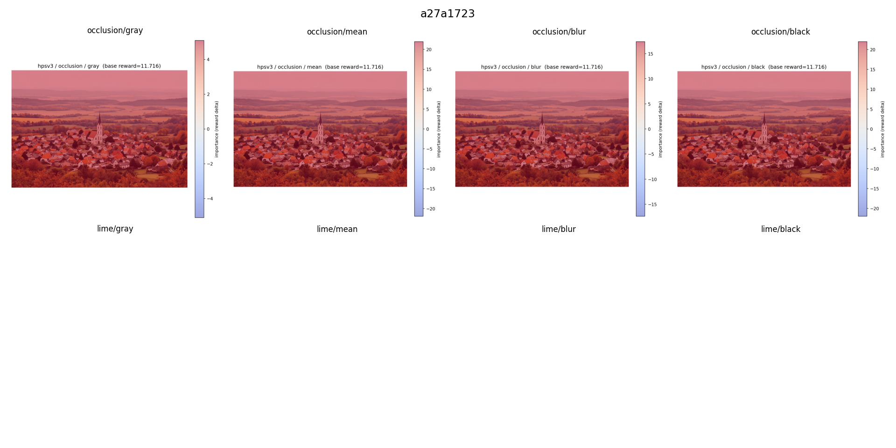

- Strongest positive region (occlusion/black): **+21.97**
- Fraction of regions that *hurt* the score: **0.0%** (min +21.97)

### 7f1e1680 — base reward μ = 10.232

Prompt: *The painting depicts a detailed watercolor scene featuring a cluster of possible strawberries surrounded by green leaves. The strawberries are rendered in various shades of red, purple, and yellow, while the leaves display hues of green and blue. The painting is placed on a white sheet of paper, whi*

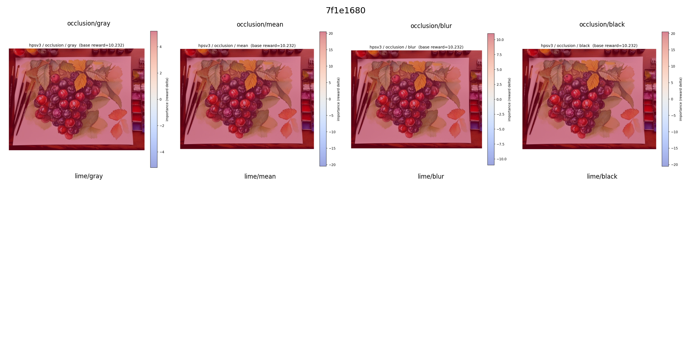

- Strongest positive region (occlusion/black): **+20.51**
- Fraction of regions that *hurt* the score: **0.0%** (min +20.51)

### 73f5615f — base reward μ = 6.163

Prompt: *The image captures a serene moment with a beautiful orange and white cat. It's lying comfortably on a concrete step, basking in what seems like warm sunlight. The cat's eyes are closed, and its expression suggests contentment and relaxation.

The cat's fur is a mix of light orange and white patches,*

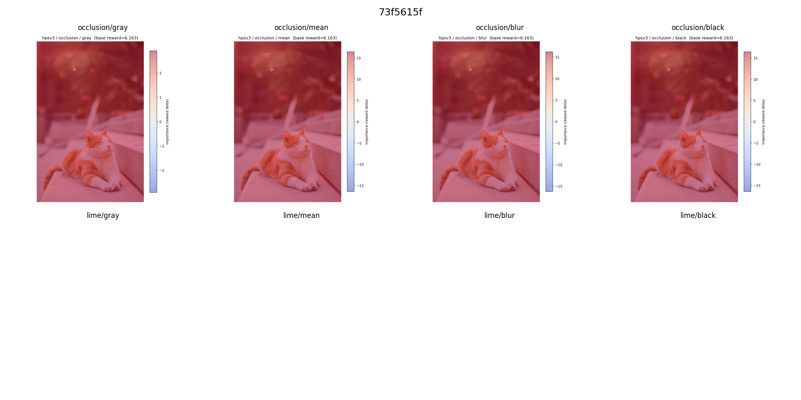

- Strongest positive region (occlusion/black): **+16.44**
- Fraction of regions that *hurt* the score: **0.0%** (min +16.44)

### 18bca469 — base reward μ = 10.866

Prompt: *Smiling blonde woman in white shirt and black skirt.*

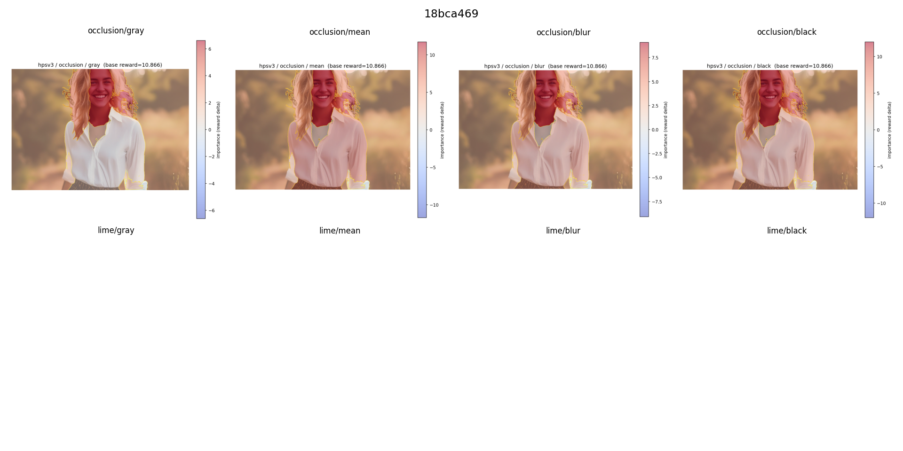

- Strongest positive region (occlusion/black): **+11.97**
- Fraction of regions that *hurt* the score: **12.5%** (min -0.04)

### 5e5334ce — base reward μ = 6.463

Prompt: *Brown cow lies in a grassy field, another in background.*

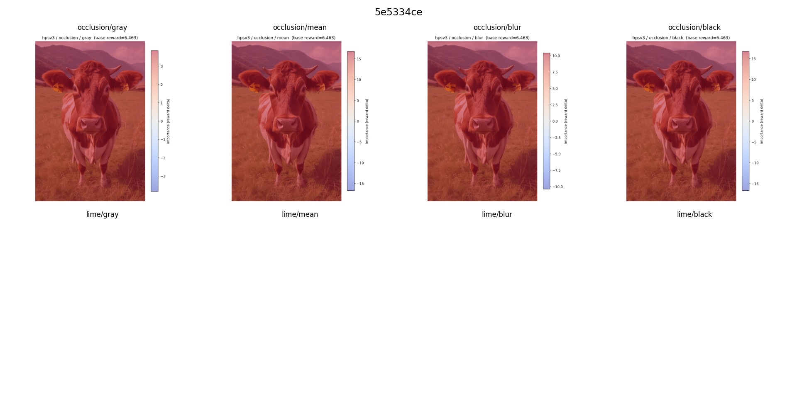

- Strongest positive region (occlusion/black): **+16.68**
- Fraction of regions that *hurt* the score: **0.0%** (min +16.68)

### f81c7de4 — base reward μ = 11.741

Prompt: *Hand touches water, creating magic and light.*

- Strongest positive region (occlusion/black): **+22.03**
- Fraction of regions that *hurt* the score: **0.0%** (min +0.66)

### 5504eb69 — base reward μ = 11.592

Prompt: *The image features a young Asian woman in professional attire, walking outdoors with a cup of coffee in hand. She is dressed in a crisp white button-down shirt and gray trousers, a classic and polished look that suggests a business or corporate environment. Her dark hair is styled in loose waves, fr*

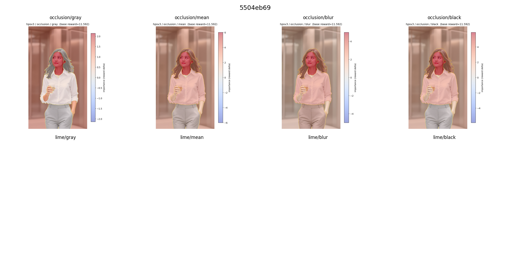

- Strongest positive region (occlusion/black): **+5.91**
- Fraction of regions that *hurt* the score: **0.0%** (min +0.06)

### 4cb1d9fb — base reward μ = 12.109

Prompt: *The image shows two fit, athletic women taking a break from their workout. They are standing outside, seemingly on a bridge or raised walkway with a city skyline and mountains visible in the background.

The woman on the left is drinking water from a clear bottle, while the other is also holding a b*

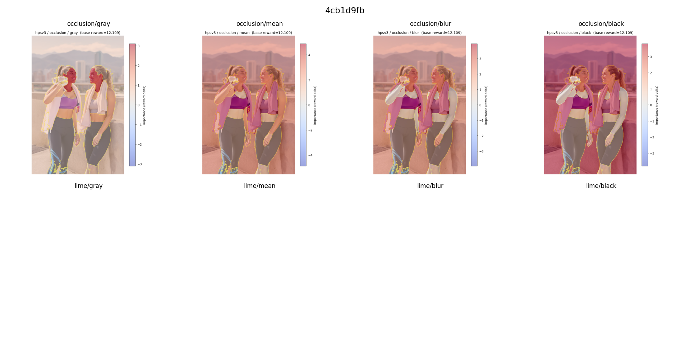

- Strongest positive region (occlusion/black): **+3.80**
- Fraction of regions that *hurt* the score: **10.0%** (min -0.09)

### bce06b44 — base reward μ = 10.933

Prompt: *Certainly! Here's a detailed description of the image:

The image features a young man standing against a solid light purple background. He has dark, curly hair and a neatly trimmed beard and mustache. He is smiling warmly, projecting a friendly and approachable demeanor.

He is wearing a colorful, *

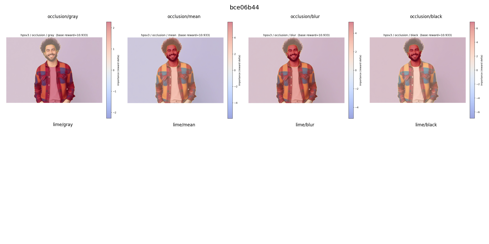

- Strongest positive region (occlusion/black): **+6.89**
- Fraction of regions that *hurt* the score: **0.0%** (min +0.26)

### f6d77bd5 — base reward μ = 14.016

Prompt: *Women enjoy cocktails and food at a social gathering.*

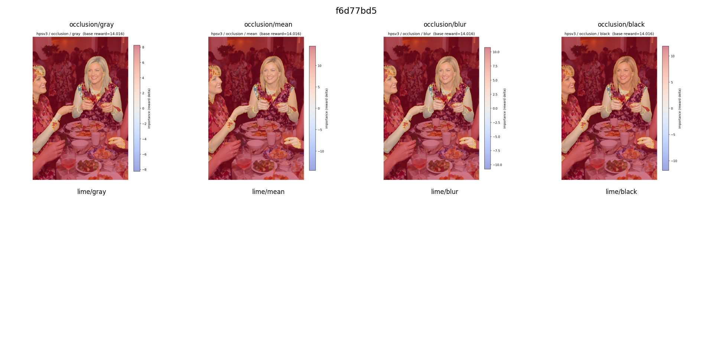

- Strongest positive region (occlusion/black): **+11.87**
- Fraction of regions that *hurt* the score: **11.1%** (min -0.03)

### 5ea2567e — base reward μ = 10.271

Prompt: *Painted woman walks with flower-filled bicycle on a sun-dappled path.*

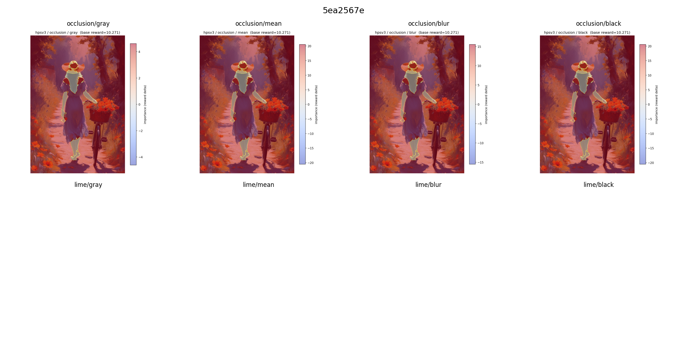

- Strongest positive region (occlusion/black): **+20.55**
- Fraction of regions that *hurt* the score: **0.0%** (min +0.03)

### 0bf6d055 — base reward μ = 15.080

Prompt: *Smiling young man and woman sitting on a fence.*

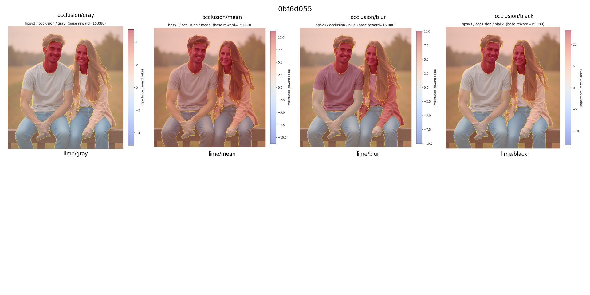

- Strongest positive region (occlusion/black): **+13.31**
- Fraction of regions that *hurt* the score: **0.0%** (min +0.03)

### 07333fd0 — base reward μ = 9.502

Prompt: *Here's a description of the image:

The image depicts a young woman with striking blue eyes and pastel-colored hair, styled in pigtails with white fluffy accessories, reminiscent of cat ears. Her hair is dyed with shades of blonde, pink, and lavender. She is positioned in what appears to be a retro *

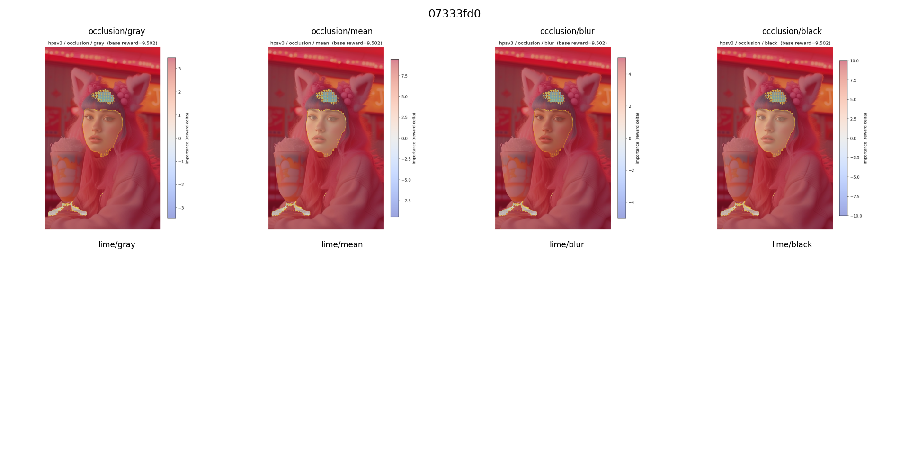

- Strongest positive region (occlusion/black): **+10.00**
- Fraction of regions that *hurt* the score: **14.3%** (min -0.09)

### 5e89d09b — base reward μ = 10.735

Prompt: *Couple skateboarding on road.*

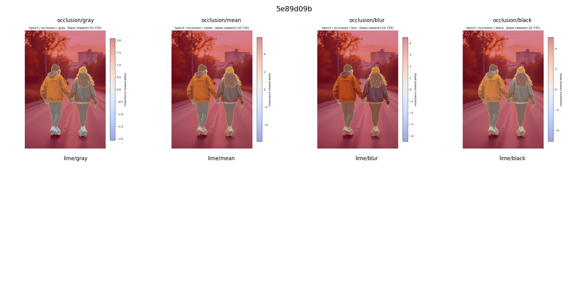

- Strongest positive region (occlusion/black): **+5.09**
- Fraction of regions that *hurt* the score: **0.0%** (min +0.07)

### 14d6bb54 — base reward μ = 7.643

Prompt: *The image is a stylized illustration of a woman walking her dog. The overall color palette is predominantly blue and green, giving it a fresh, airy feel. The woman is depicted in motion, with her arm extended, holding a leash connected to a small, dark-colored dog that appears to be trotting eagerly*

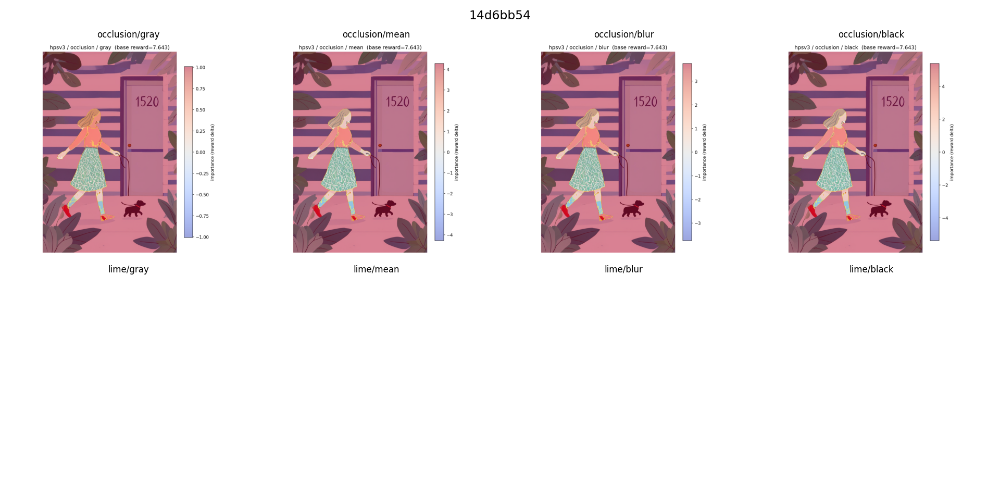

- Strongest positive region (occlusion/black): **+5.39**
- Fraction of regions that *hurt* the score: **30.0%** (min -0.08)

### 56130b57 — base reward μ = 13.086

Prompt: *Smiling woman in black pants sits in a salon chair.*

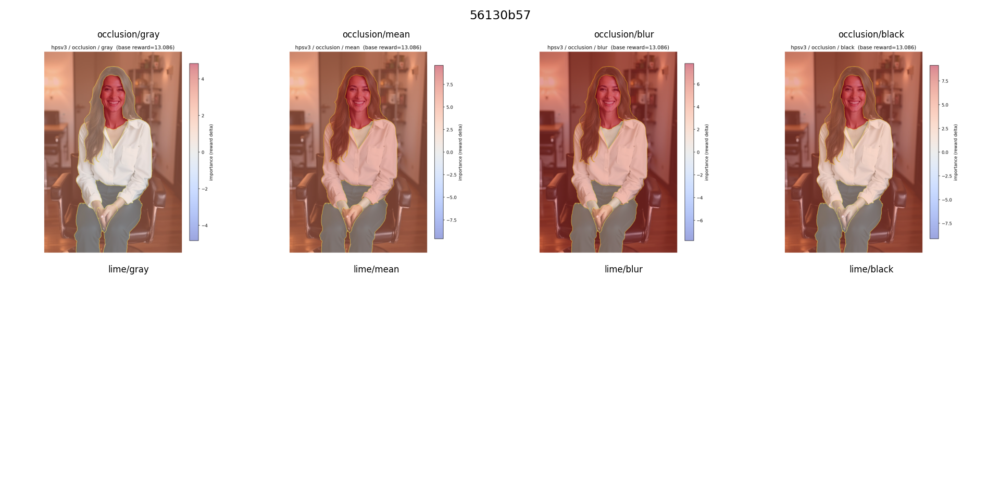

- Strongest positive region (occlusion/black): **+9.13**
- Fraction of regions that *hurt* the score: **0.0%** (min +0.03)

### 2f466312 — base reward μ = 12.459

Prompt: *A nude-shaped candle burns atop a rustic wooden slice with greenery.*

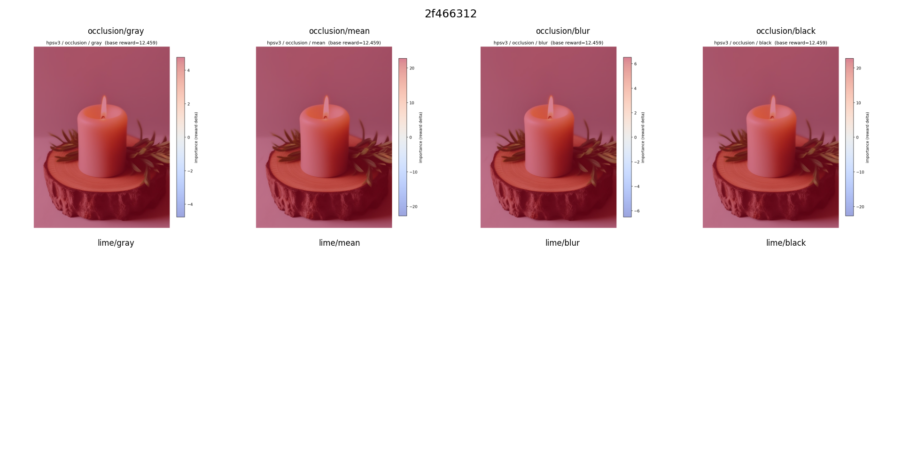

- Strongest positive region (occlusion/black): **+22.72**
- Fraction of regions that *hurt* the score: **0.0%** (min +22.72)

### 7a09cfa0 — base reward μ = 7.783

Prompt: *The image captures a whimsical moment with two women standing on a gravel path surrounded by greenery, appearing to be in a park-like setting. Overhead, a tree with lush foliage partially obscures the sky, casting dappled light.

Both women are wearing vibrant, ruffled, strapless mini-dresses of the*

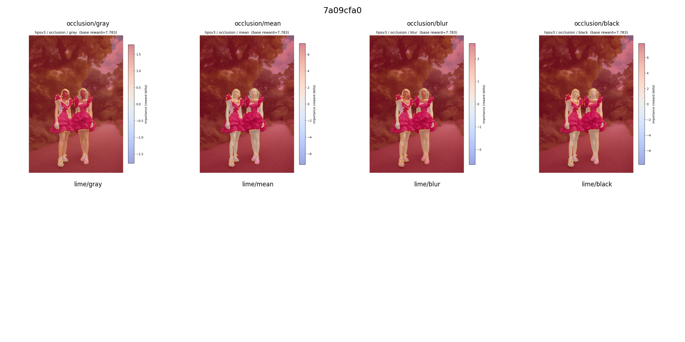

- Strongest positive region (occlusion/black): **+7.80**
- Fraction of regions that *hurt* the score: **0.0%** (min +0.86)

### 0748f1b0 — base reward μ = 6.321

Prompt: *Certainly! Here is a detailed description of the image:

The image presents a sleek black Mercedes-Benz coupe in a low-angle shot. The car dominates the left side of the frame, showcasing its iconic logo and modern headlight design with a curved LED accent. The rest of the car fades into darkness as*

- Strongest positive region (occlusion/black): **+16.62**
- Fraction of regions that *hurt* the score: **0.0%** (min +16.62)

### db4f6c51 — base reward μ = 12.637

Prompt: *Certainly, let's describe the image.

The image showcases a close-up of a "Baby Yoda" figurine, set against a stark black background. This isolates the figure, drawing the viewer's attention to its details.

The figurine is predominantly a pale greenish-blue, capturing the character's distinctive sk*

- Strongest positive region (occlusion/black): **+22.42**
- Fraction of regions that *hurt* the score: **33.3%** (min -0.04)

### 06842ff3 — base reward μ = 9.589

Prompt: *Certainly! Here's a description of the image:

The image features a zebra standing in a field of tall grass interspersed with clusters of bright yellow wildflowers. The zebra is positioned slightly off-center, facing left, with its distinct black and white stripes clearly visible. Its head is angled*

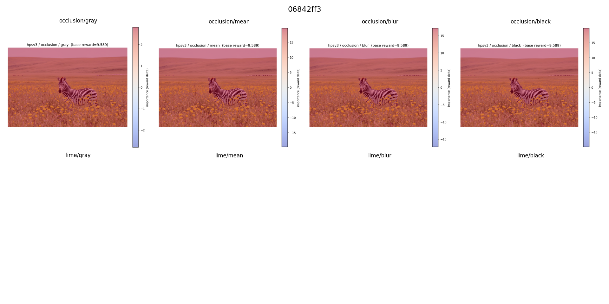

- Strongest positive region (occlusion/black): **+19.87**
- Fraction of regions that *hurt* the score: **0.0%** (min +19.87)

### 74d745bf — base reward μ = 12.535

Prompt: *Illuminated building at night with blurred light trails on the road.*

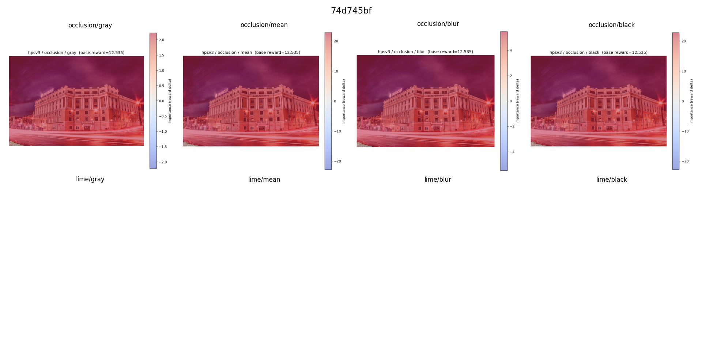

- Strongest positive region (occlusion/black): **+22.78**
- Fraction of regions that *hurt* the score: **0.0%** (min +0.13)

### a57a9e5c — base reward μ = 8.214

Prompt: *Asian man in boxing stance, wearing red gloves and shorts.*

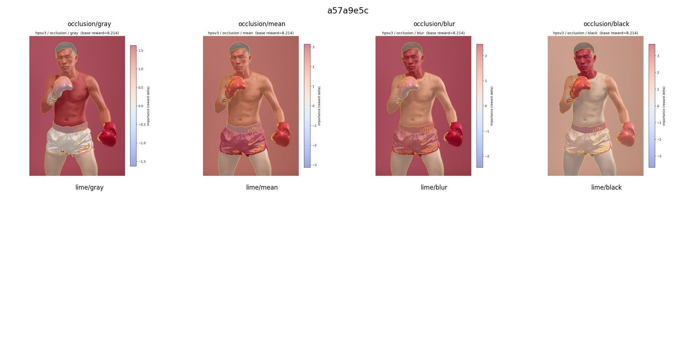

- Strongest positive region (occlusion/black): **+3.69**
- Fraction of regions that *hurt* the score: **10.0%** (min -0.24)

### 6d1e9865 — base reward μ = 9.138

Prompt: *The image captures a romantic scene featuring a couple in a passionate embrace. The woman, with auburn hair and fair skin, is reclining on a lavish cream-colored chaise lounge with intricate gilded details. She is wearing a flowing green gown that cascades around her, with shades of blue shimmering *

- Strongest positive region (occlusion/black): **+6.35**
- Fraction of regions that *hurt* the score: **14.3%** (min -0.18)

### 25e406d3 — base reward μ = 10.396

Prompt: *Newlyweds embrace beside a pool, lush foliage behind.*

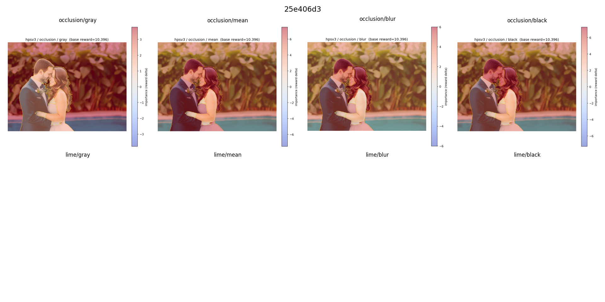

- Strongest positive region (occlusion/black): **+7.28**
- Fraction of regions that *hurt* the score: **0.0%** (min +0.06)

### cefb4080 — base reward μ = 9.022

Prompt: *The aerial shot presents a serene, winding river bordered by dense green vegetation. The water transitions from a lighter turquoise near the shore to a deeper teal in the center, reflecting sunlight in subtle patterns. A small, bright pink kayak with two occupants is positioned in the middle of the *

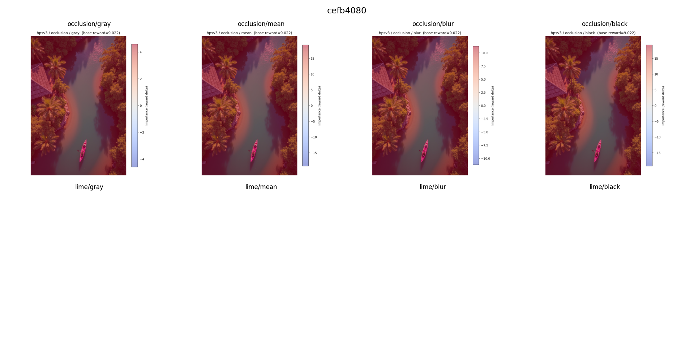

- Strongest positive region (occlusion/black): **+19.26**
- Fraction of regions that *hurt* the score: **0.0%** (min +19.26)

### c4da57ac — base reward μ = 7.561

Prompt: *The image is a digitally created, stylized representation of a squash or tennis player in action. The backdrop is primarily a textured, vibrant green with scattered dark splatters. A circular green gradient frames the main subject, and curved green lines fade into the black lower portion of the imag*

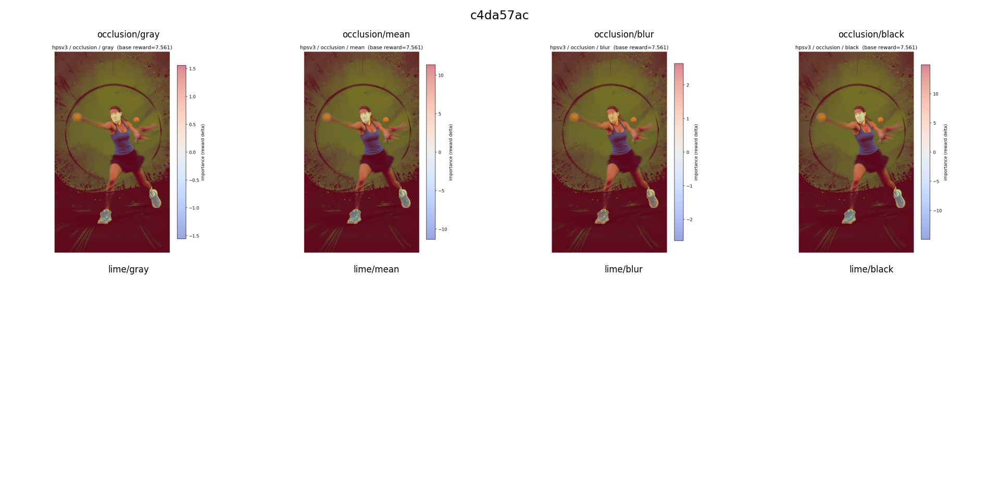

- Strongest positive region (occlusion/black): **+14.96**
- Fraction of regions that *hurt* the score: **28.6%** (min -0.06)

### b998a060 — base reward μ = 7.826

Prompt: *Black and white cat stretches on a tiled patio.*

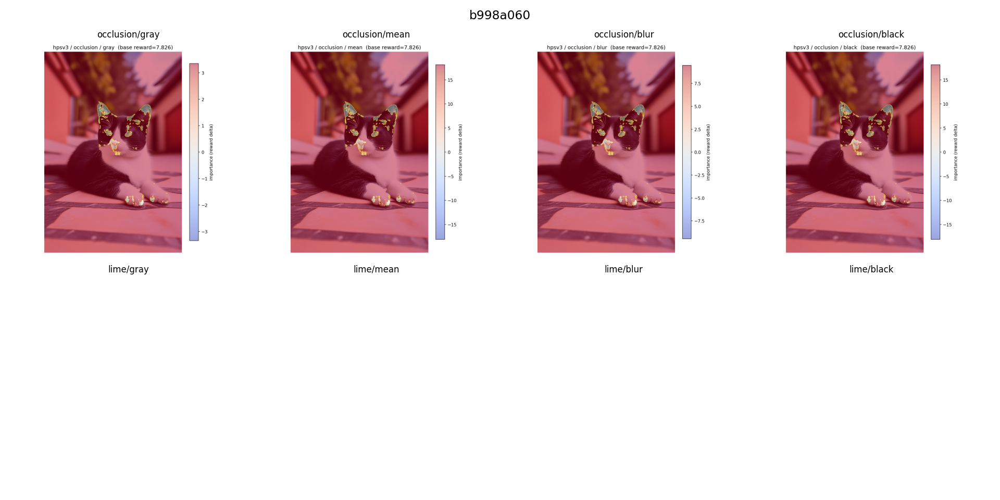

- Strongest positive region (occlusion/black): **+18.10**
- Fraction of regions that *hurt* the score: **25.0%** (min -0.19)

### 92415a1a — base reward μ = 12.964

Prompt: *The image is a vintage-style barbershop illustration, reminiscent of classic tattoo designs. At the center is a woman with a determined expression, styled as a retro barber. She sports a blue headscarf and large hoop earrings, with a few tattoos visible on her face. She holds a comb in one hand and *

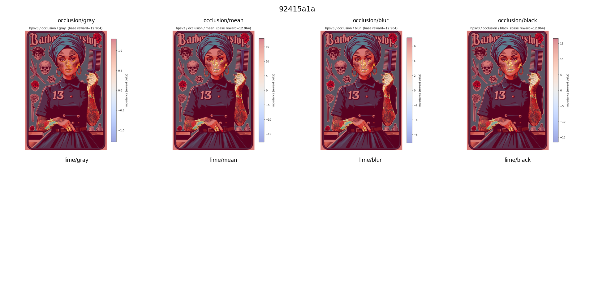

- Strongest positive region (occlusion/black): **+16.57**
- Fraction of regions that *hurt* the score: **16.7%** (min -0.09)

### eaa351af — base reward μ = 6.682

Prompt: *A large, white stone archway stands tall against a clear blue sky.*

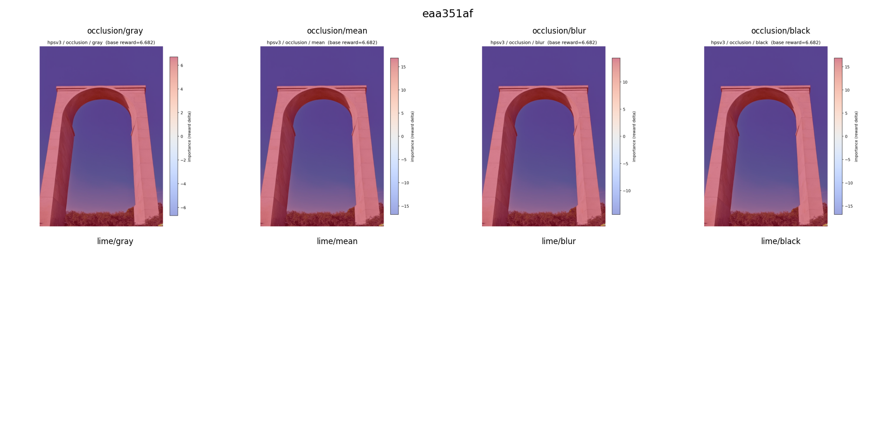

- Strongest positive region (occlusion/black): **+16.85**
- Fraction of regions that *hurt* the score: **0.0%** (min +0.02)

### cc2fbd21 — base reward μ = 11.478

Prompt: *Captured in a high-angle medium shot, a young man perches thoughtfully atop a craggy, reddish-brown rock formation. He is turned towards the left side of the frame, gazing into the distance with a contemplative expression.

The man is dressed in a casual, modern style. A dark-colored baseball cap si*

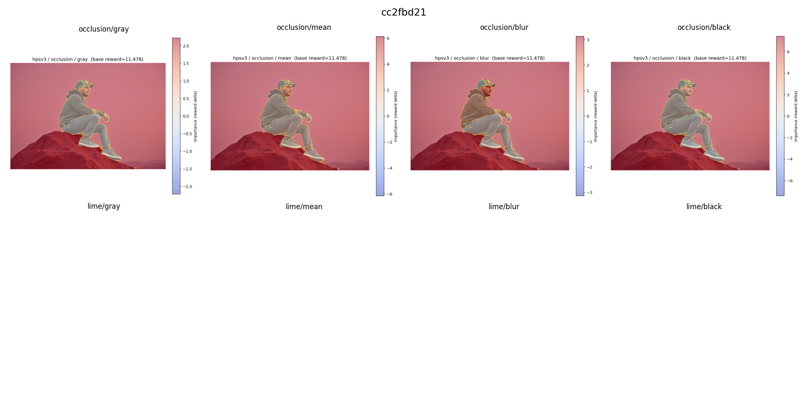

- Strongest positive region (occlusion/black): **+7.43**
- Fraction of regions that *hurt* the score: **0.0%** (min +0.01)

### 3040b049 — base reward μ = 11.707

Prompt: *In a studio portrait, a young professional-looking African-American man and woman are seen against a solid gray background. The man is standing slightly in front of the woman and to the right, holding a tablet in his hands. He is wearing a vertically striped button-up shirt under a black blazer. The*

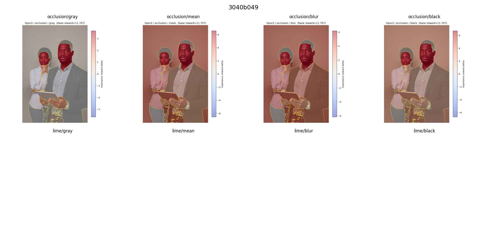

- Strongest positive region (occlusion/black): **+6.69**
- Fraction of regions that *hurt* the score: **22.2%** (min -0.03)

### 5582d290 — base reward μ = 9.332

Prompt: *The image is an artistic illustration featuring a surreal and dreamy scene at twilight. A colossal, transparent jellyfish-like creature dominates the sky, its dome a mixture of iridescent colors – soft pinks, purples, and a hint of blue. A tiny crescent moon is nestled within its translucent body. I*

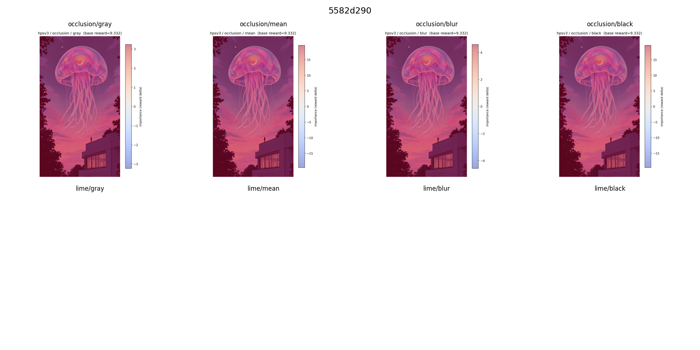

- Strongest positive region (occlusion/black): **+19.62**
- Fraction of regions that *hurt* the score: **0.0%** (min +0.10)

### 60f602ac — base reward μ = 9.283

Prompt: *The image presents a serene and captivating scene set within a dense forest. A woman, adorned in a striking red gown, sits gracefully amidst the woodland landscape. Her dark hair complements the richness of her dress, and her gaze is directed slightly upwards, as if contemplating the surrounding nat*

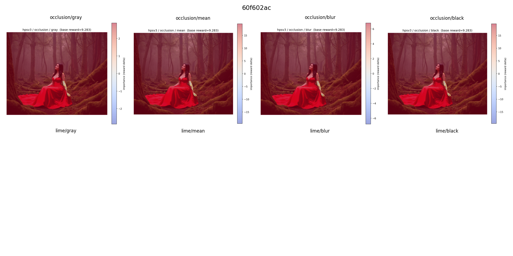

- Strongest positive region (occlusion/black): **+19.58**
- Fraction of regions that *hurt* the score: **0.0%** (min +0.19)

### 927d556f — base reward μ = 9.195

Prompt: *The image is a digitally painted scene of a black and white cat sitting next to a small snowman in a snowy landscape. The cat is the most prominent figure, positioned on the left side of the image. It sports a bright red scarf, contrasting sharply with its black and white fur. The cat has a curious,*

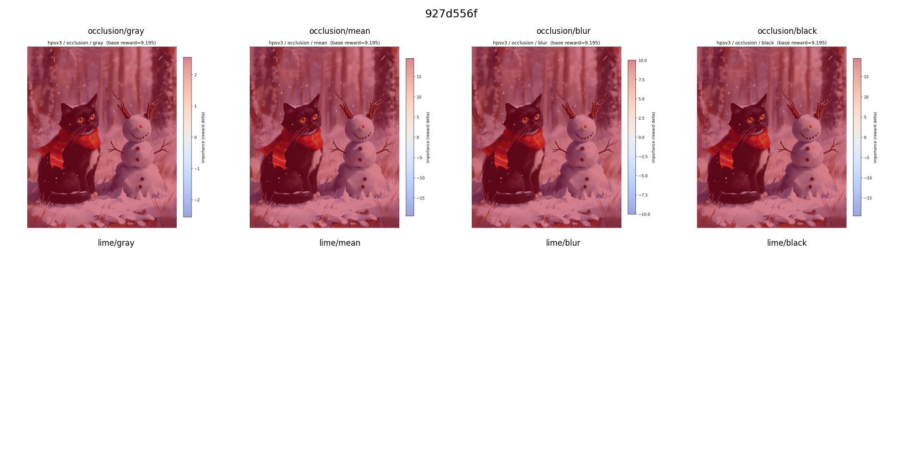

- Strongest positive region (occlusion/black): **+19.47**
- Fraction of regions that *hurt* the score: **0.0%** (min +0.07)

### 601dfdf2 — base reward μ = 4.360

Prompt: *Woman meditates on a dock over water, reflection visible.*

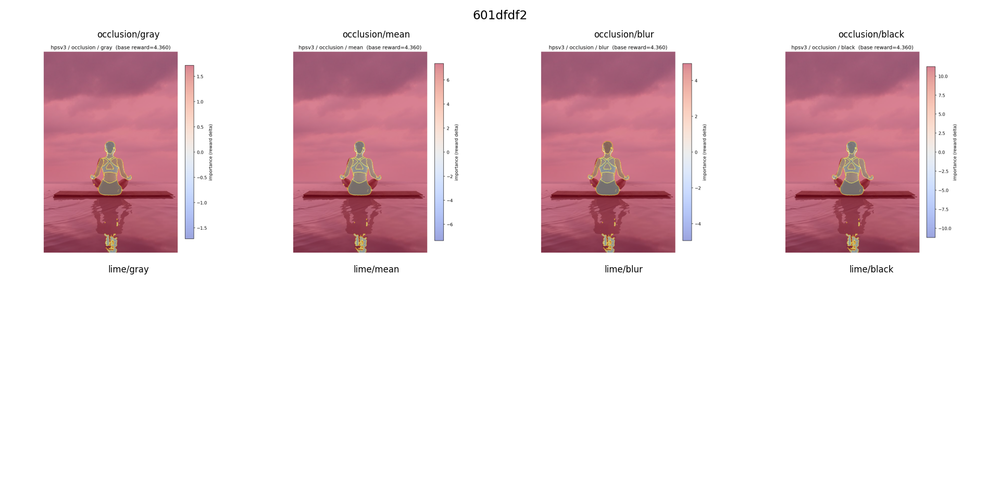

- Strongest positive region (occlusion/black): **+11.23**
- Fraction of regions that *hurt* the score: **22.2%** (min -0.05)

### 8d11ee8a — base reward μ = 14.415

Prompt: *The photograph showcases an elegantly dressed elderly couple, their foreheads gently touching, hands clasped in what appears to be a tender moment of shared affection. The man, with his distinguished white hair and beard, is clad in a classic, long, grey plaid coat. He is also wearing brown leather *

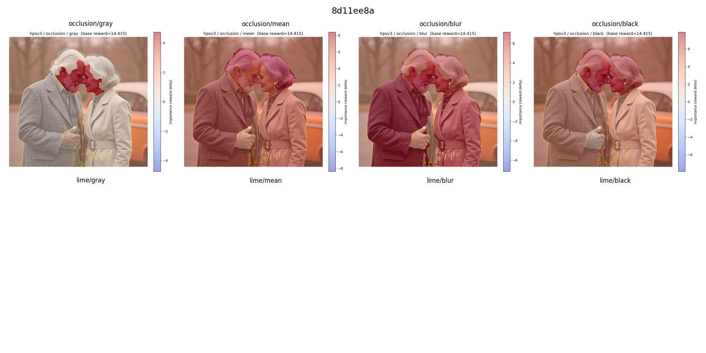

- Strongest positive region (occlusion/black): **+7.91**
- Fraction of regions that *hurt* the score: **33.3%** (min -0.22)

### 7c94b234 — base reward μ = 14.698

Prompt: *Abstract art featuring swirling blues, purples, and whites with bubble-like textures.*

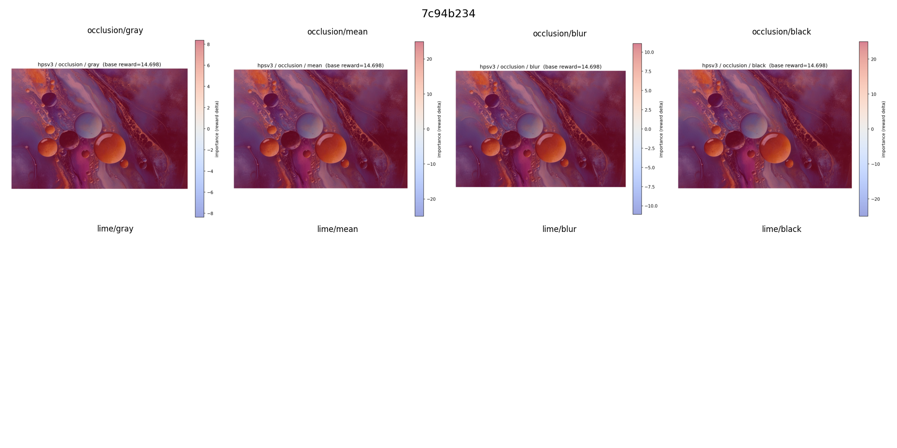

- Strongest positive region (occlusion/black): **+24.98**
- Fraction of regions that *hurt* the score: **0.0%** (min +24.98)

### 647383a5 — base reward μ = 8.287

Prompt: *The image captures a moment of pure joy as a young girl runs along a sun-kissed beach. She is barefoot and dressed in a vibrant yellow t-shirt underneath a dark blue denim jumper dress. She is turning towards the camera, holding out one side of her dress as she runs, a wide smile lighting up her fac*

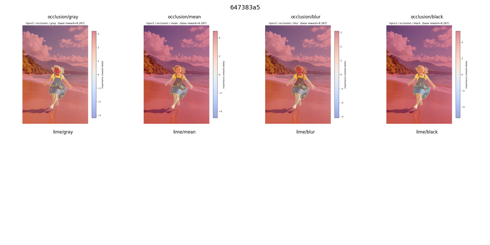

- Strongest positive region (occlusion/black): **+5.38**
- Fraction of regions that *hurt* the score: **10.0%** (min -0.03)

### 8b8f0909 — base reward μ = 13.957

Prompt: *The image captures a young man walking down a narrow city street, shot from a slightly low angle. He is facing forward but glancing over his left shoulder, engaging the viewer with his gaze. His dark hair is neatly styled.

He is wearing a classic, slightly worn black leather jacket, which reflects *

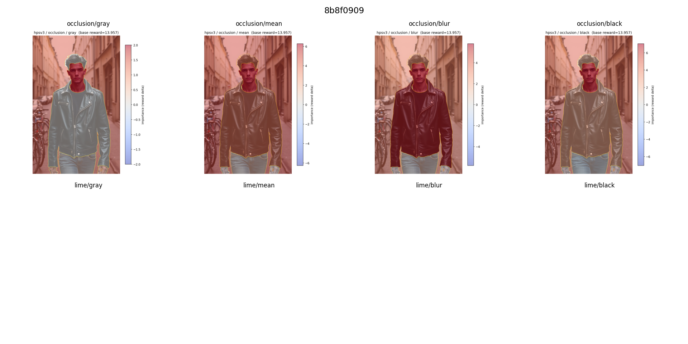

- Strongest positive region (occlusion/black): **+7.05**
- Fraction of regions that *hurt* the score: **14.3%** (min -0.05)

### fc641478 — base reward μ = 11.936

Prompt: *Sunlit birch trees stand out in a dark forest.*

- Strongest positive region (occlusion/black): **+22.15**
- Fraction of regions that *hurt* the score: **0.0%** (min +22.15)

### 1a42e12b — base reward μ = 10.299

Prompt: *Black Converse sneakers sit on a rocky beach by the water.*

- Strongest positive region (occlusion/black): **+20.51**
- Fraction of regions that *hurt* the score: **0.0%** (min +0.04)

### e0d29681 — base reward μ = 14.190

Prompt: *Watercolor painting of a window with red flowers.*

- Strongest positive region (occlusion/black): **+24.41**
- Fraction of regions that *hurt* the score: **0.0%** (min +24.41)

### ae9889bf — base reward μ = 8.168

Prompt: *Woman squats stylishly before futuristic architecture.*

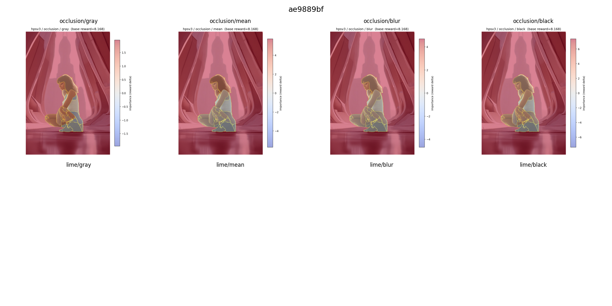

- Strongest positive region (occlusion/black): **+7.38**
- Fraction of regions that *hurt* the score: **20.0%** (min -0.17)

### ead82a7e — base reward μ = 9.454

Prompt: *The image showcases a delicate, light pink rose in full bloom, positioned as the focal point against a stark white backdrop. The rose's petals are tightly curled at the center, gradually unfurling outwards in a mesmerizing swirl of soft hues. The outer petals exhibit a slightly aged appearance, with*

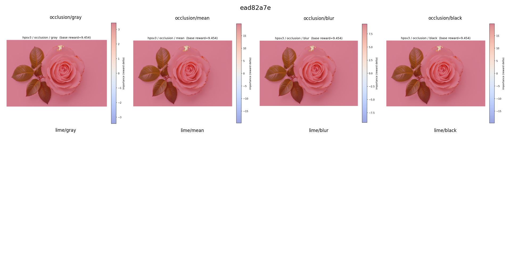

- Strongest positive region (occlusion/black): **+19.75**
- Fraction of regions that *hurt* the score: **0.0%** (min +0.31)

### d8403139 — base reward μ = 9.922

Prompt: *The image captures a moment of relaxation and connection with nature. A person's hand, adorned with a delicate silver ring on the ring finger and sporting dark blue nail polish, holds a metal cup. The hand and cup are positioned in front of a car window, suggesting a roadside stop. The vehicle's doo*

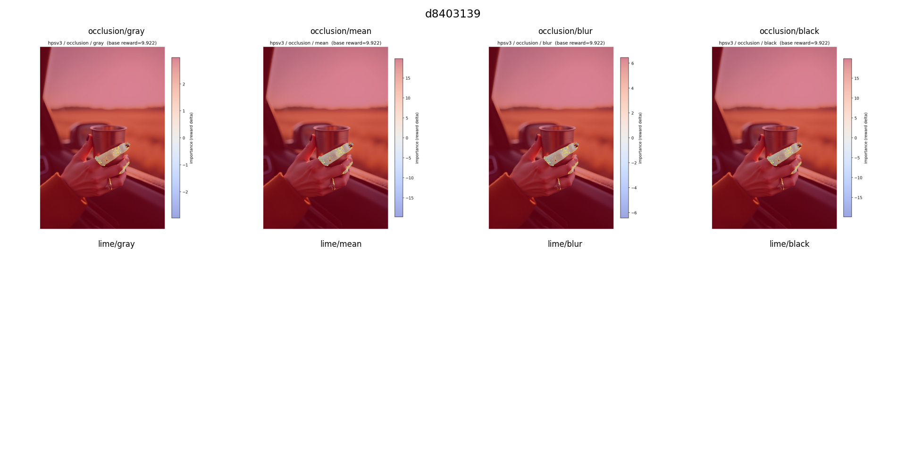

- Strongest positive region (occlusion/black): **+19.89**
- Fraction of regions that *hurt* the score: **16.7%** (min -0.01)

### 001c2723 — base reward μ = 10.486

Prompt: *This image captures the interior of a lavishly decorated building, likely a religious structure such as a church or cathedral. The photo was taken from a low angle, looking upwards, emphasizing the grandeur of the architecture. There is a large circular skylight in the ceiling that allows natural li*

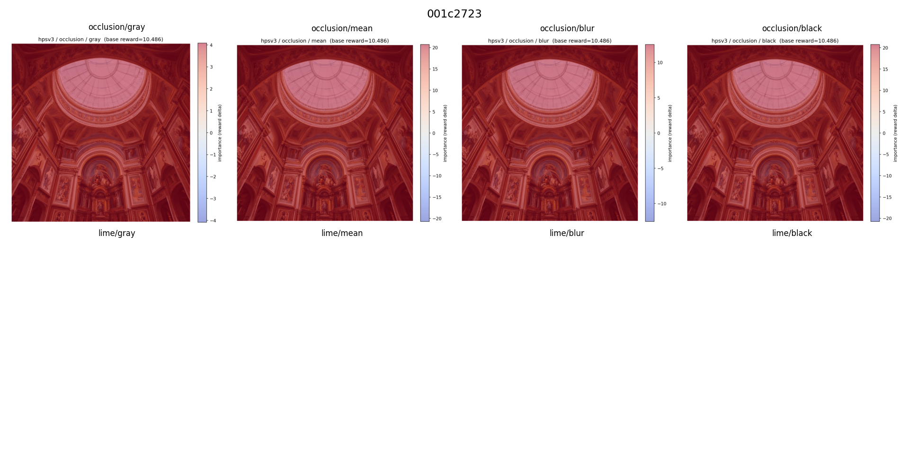

- Strongest positive region (occlusion/black): **+20.75**
- Fraction of regions that *hurt* the score: **0.0%** (min +20.75)

### d0f0787a — base reward μ = 11.466

Prompt: *Four American football players in uniform stand on the field with a football.*

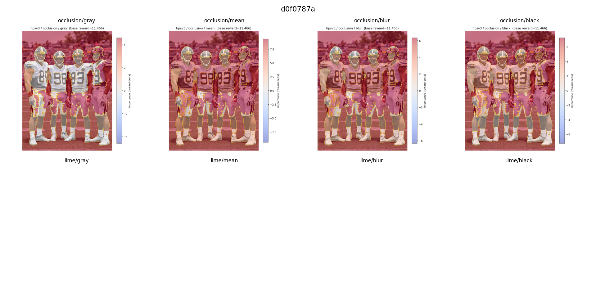

- Strongest positive region (occlusion/black): **+7.25**
- Fraction of regions that *hurt* the score: **10.0%** (min -0.03)

### 4ebe4ec3 — base reward μ = 12.331

Prompt: *Snowy forest filled with tall, thin trees.*

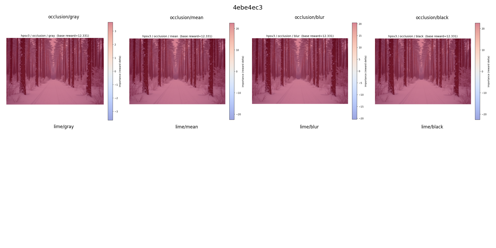

- Strongest positive region (occlusion/black): **+22.54**
- Fraction of regions that *hurt* the score: **0.0%** (min +22.54)

### 577d09f9 — base reward μ = 7.833

Prompt: *Monochrome portrait of a woman sitting cross-legged.*

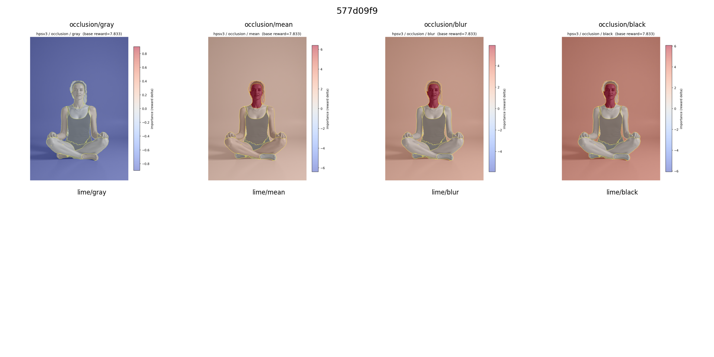

- Strongest positive region (occlusion/black): **+6.07**
- Fraction of regions that *hurt* the score: **10.0%** (min -0.04)

### 41003c46 — base reward μ = 6.202

Prompt: *Smiling woman in pink shirt and denim jacket.*

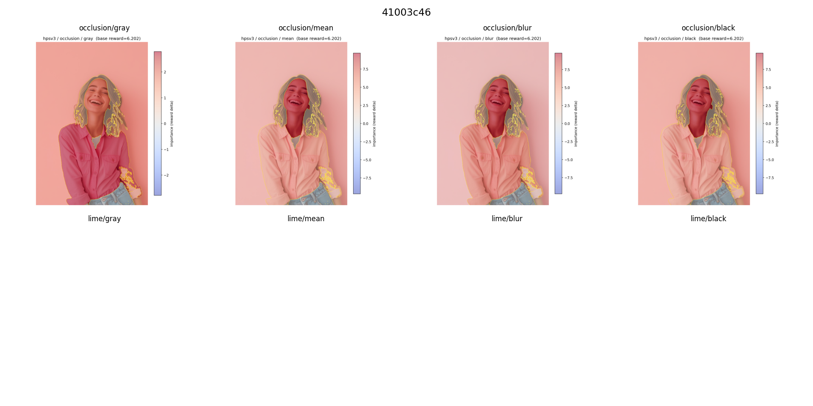

- Strongest positive region (occlusion/black): **+9.76**
- Fraction of regions that *hurt* the score: **14.3%** (min -0.03)

### 1c522730 — base reward μ = 12.095

Prompt: *Sunset illuminates rocks, flowers, and deer in a hilly meadow.*

- Strongest positive region (occlusion/black): **+22.29**
- Fraction of regions that *hurt* the score: **60.0%** (min -0.03)

### 023667bc — base reward μ = 11.951

Prompt: *Black Converse sneakers sit on a rocky beach by the water.*

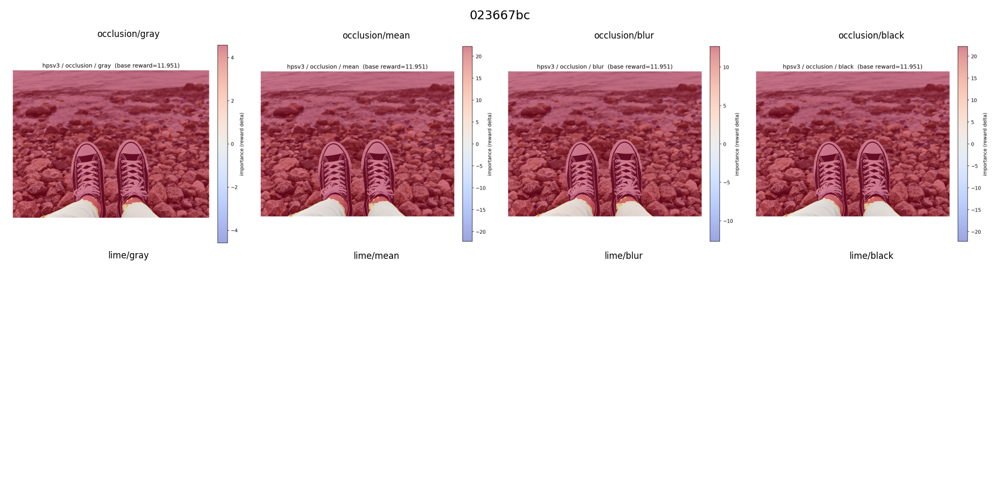

- Strongest positive region (occlusion/black): **+22.22**
- Fraction of regions that *hurt* the score: **16.7%** (min -0.02)

### ebc78d2e — base reward μ = 15.704

Prompt: *Sweaty, muscular woman in sports bra stands in gym, hands on hips.*

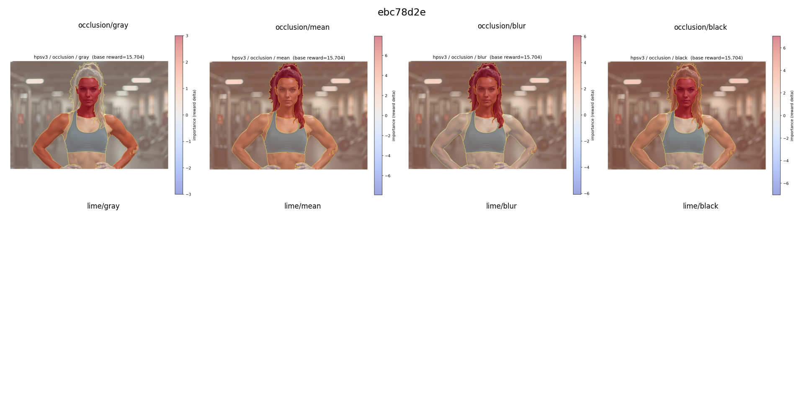

- Strongest positive region (occlusion/black): **+7.04**
- Fraction of regions that *hurt* the score: **0.0%** (min +0.04)

### ef87eebb — base reward μ = 12.495

Prompt: *The image captures a close-up of a dog's head, viewed from a slightly low angle, imparting a sense of height and stature to the animal. The dog's fur is a blend of light tan and white, particularly noticeable as a stripe down the center of its face. Its eyes, amber in color, are focused upwards and *

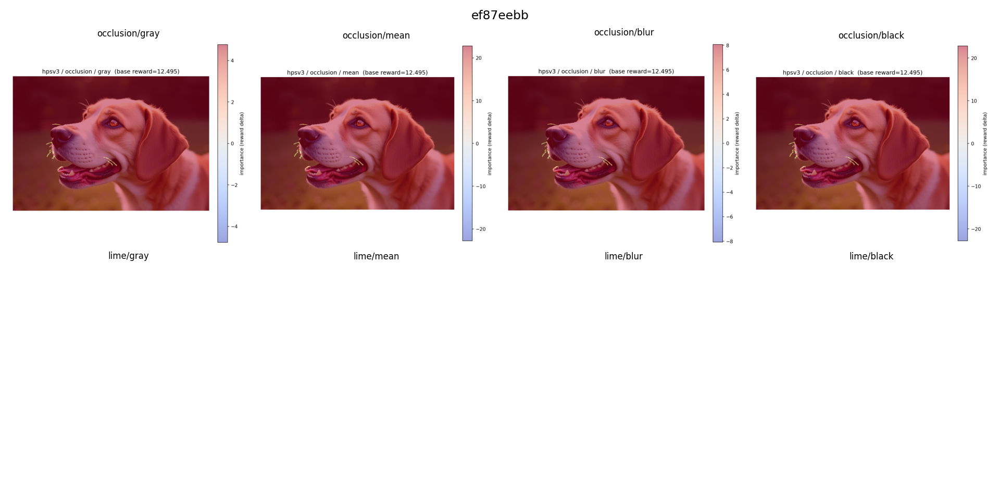

- Strongest positive region (occlusion/black): **+22.79**
- Fraction of regions that *hurt* the score: **0.0%** (min +0.07)

### 0c217725 — base reward μ = 7.935

Prompt: *The image captures a vibrant outdoor scene where a series of colorful umbrellas are hung beneath white netting ropes. The background is a clear blue sky. These umbrellas appear to be made of paper or thin plastic and are arranged in a cascading manner, with each rope supporting multiple umbrellas. T*

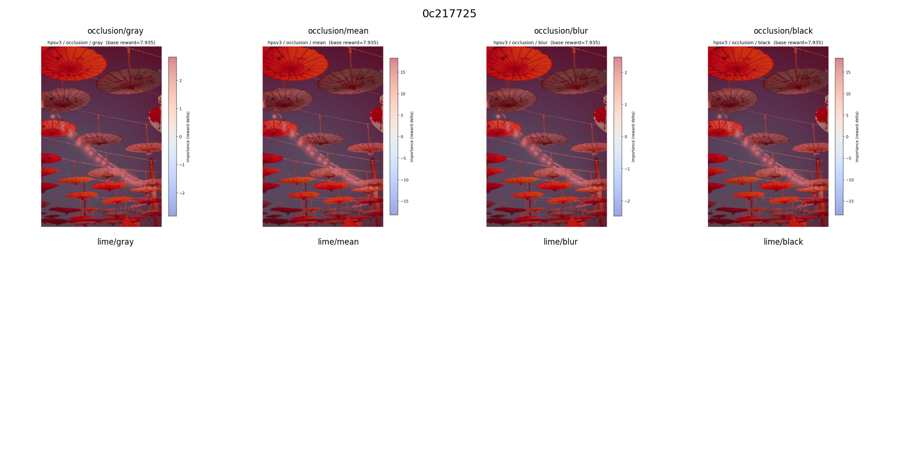

- Strongest positive region (occlusion/black): **+18.23**
- Fraction of regions that *hurt* the score: **16.7%** (min -0.07)

### 9a1a949a — base reward μ = 12.054

Prompt: *The image presents a close-up, dramatic portrait of a young man with a vintage and slightly mysterious air. He is adorned with a black fedora, casting a shadow over his brow. Rectangular spectacles frame his eyes, adding an intellectual touch to his overall appearance.

Wisps of smoke curl from his *

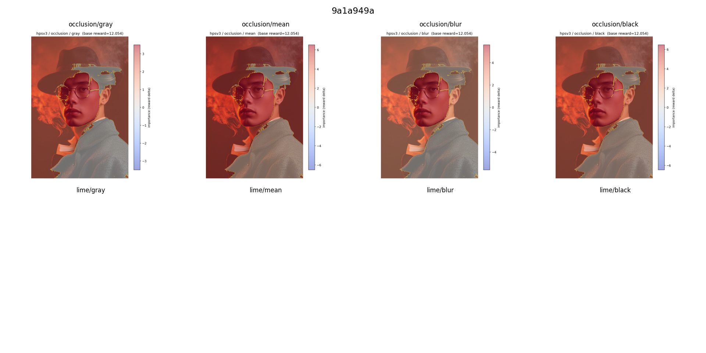

- Strongest positive region (occlusion/black): **+6.47**
- Fraction of regions that *hurt* the score: **0.0%** (min +1.02)

## 2. Occlusion vs LIME agreement (cross-method validation)

| image | mode | spearman_occ_vs_lime |
| --- | --- | --- |

## 3. Baseline (color-perturbation) sensitivity

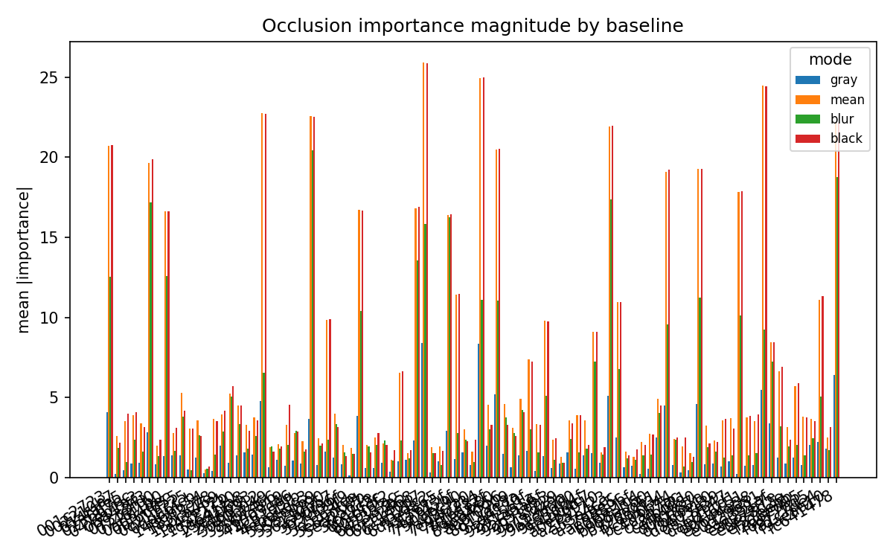

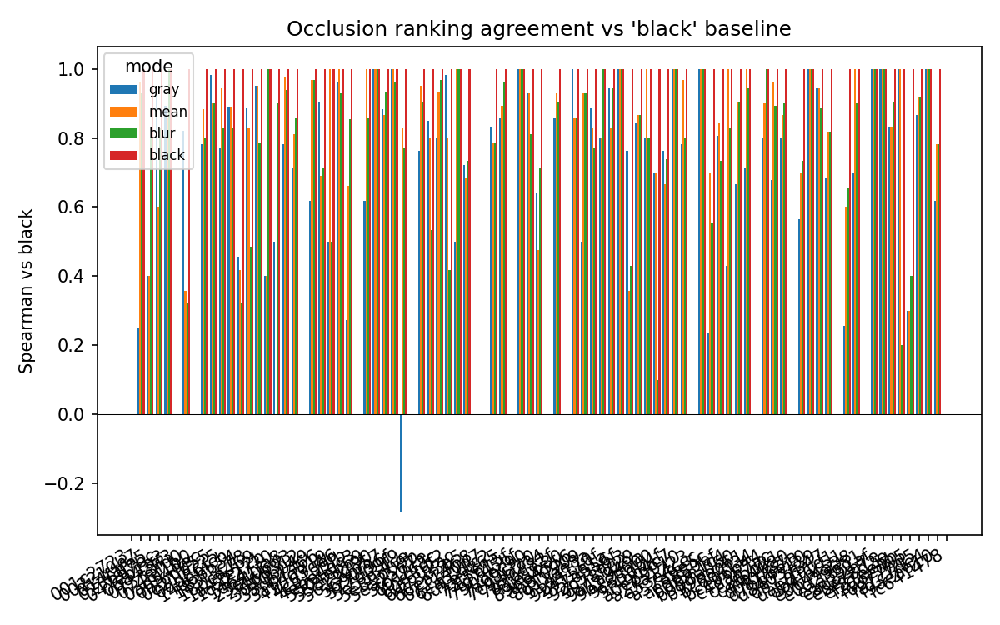

| image | mode | spearman_vs_black |
| --- | --- | --- |
| 66ea2468 | gray | nan |
| 66ea2468 | mean | nan |
| 66ea2468 | blur | nan |
| 66ea2468 | black | nan |
| 89b64556 | gray | 1.0 |
| 89b64556 | mean | 0.857 |
| 89b64556 | blur | 0.857 |
| 89b64556 | black | 1.0 |
| f266ed95 | gray | 0.3 |
| f266ed95 | mean | 0.3 |
| f266ed95 | blur | 0.4 |
| f266ed95 | black | 1.0 |
| 183f3c78 | gray | 0.886 |
| 183f3c78 | mean | 0.829 |
| 183f3c78 | blur | 0.486 |
| 183f3c78 | black | 1.0 |
| 38db7466 | gray | 0.905 |
| 38db7466 | mean | 0.69 |
| 38db7466 | blur | 0.714 |
| 38db7466 | black | 1.0 |
| 92c51da3 | gray | 0.762 |
| 92c51da3 | mean | 0.357 |
| 92c51da3 | blur | 0.429 |
| 92c51da3 | black | 1.0 |
| b99bec61 | gray | 0.714 |
| b99bec61 | mean | 1.0 |
| b99bec61 | blur | 0.943 |
| b99bec61 | black | 1.0 |
| 0dd86fcb | gray | 0.891 |
| 0dd86fcb | mean | 0.891 |
| 0dd86fcb | blur | 0.83 |
| 0dd86fcb | black | 1.0 |
| 7908ec90 | gray | 0.929 |
| 7908ec90 | mean | 0.929 |
| 7908ec90 | blur | 0.81 |
| 7908ec90 | black | 1.0 |
| 002210b7 | gray | 0.25 |
| 002210b7 | mean | 0.964 |
| 002210b7 | blur | 0.929 |
| 002210b7 | black | 1.0 |
| 9c35db4f | gray | 0.762 |
| 9c35db4f | mean | 0.667 |
| 9c35db4f | blur | 0.738 |
| 9c35db4f | black | 1.0 |
| a53e4ccc | gray | 1.0 |
| a53e4ccc | mean | 1.0 |
| a53e4ccc | blur | 1.0 |
| a53e4ccc | black | 1.0 |
| dae811d1 | gray | nan |
| dae811d1 | mean | nan |
| dae811d1 | blur | nan |
| dae811d1 | black | nan |
| 047eb1a3 | gray | 0.893 |
| 047eb1a3 | mean | 0.857 |
| 047eb1a3 | blur | 1.0 |
| 047eb1a3 | black | 1.0 |
| 7d26c82f | gray | 0.857 |
| 7d26c82f | mean | 0.929 |
| 7d26c82f | blur | 0.905 |
| 7d26c82f | black | 1.0 |
| f9aeaa10 | gray | 0.617 |
| f9aeaa10 | mean | 0.783 |
| f9aeaa10 | blur | 0.783 |
| f9aeaa10 | black | 1.0 |
| 0ad54dec | gray | 0.783 |
| 0ad54dec | mean | 0.883 |
| 0ad54dec | blur | 0.8 |
| 0ad54dec | black | 1.0 |
| 671140d7 | gray | nan |
| 671140d7 | mean | nan |
| 671140d7 | blur | nan |
| 671140d7 | black | nan |
| 9978f229 | gray | 0.842 |
| 9978f229 | mean | 0.867 |
| 9978f229 | blur | 0.867 |
| 9978f229 | black | 1.0 |
| 3a64ad19 | gray | 0.5 |
| 3a64ad19 | mean | 1.0 |
| 3a64ad19 | blur | 0.5 |
| 3a64ad19 | black | 1.0 |
| b0f5e1c4 | gray | 0.429 |
| b0f5e1c4 | mean | 1.0 |
| b0f5e1c4 | blur | 0.829 |
| b0f5e1c4 | black | 1.0 |
| 014fafe5 | gray | 0.4 |
| 014fafe5 | mean | 0.4 |
| 014fafe5 | blur | 0.8 |
| 014fafe5 | black | 1.0 |
| 5fcc7c2c | gray | 0.8 |
| 5fcc7c2c | mean | 0.933 |
| 5fcc7c2c | blur | 0.967 |
| 5fcc7c2c | black | 1.0 |
| e0644a38 | gray | 0.7 |
| e0644a38 | mean | 1.0 |
| e0644a38 | blur | 0.9 |
| e0644a38 | black | 1.0 |
| 9b1cb600 | gray | 0.7 |
| 9b1cb600 | mean | 0.7 |
| 9b1cb600 | blur | 0.1 |
| 9b1cb600 | black | 1.0 |
| bc6d4f34 | gray | nan |
| bc6d4f34 | mean | nan |
| bc6d4f34 | blur | nan |
| bc6d4f34 | black | nan |
| a0eb9910 | gray | 0.783 |
| a0eb9910 | mean | 0.967 |
| a0eb9910 | blur | 0.8 |
| a0eb9910 | black | 1.0 |
| 9f4bb4c7 | gray | 1.0 |
| 9f4bb4c7 | mean | 1.0 |
| 9f4bb4c7 | blur | 1.0 |
| 9f4bb4c7 | black | 1.0 |
| 6ca521c2 | gray | 0.833 |
| 6ca521c2 | mean | 0.786 |
| 6ca521c2 | blur | 0.786 |
| 6ca521c2 | black | 1.0 |
| 1d641fa8 | gray | 0.782 |
| 1d641fa8 | mean | 0.976 |
| 1d641fa8 | blur | 0.939 |
| 1d641fa8 | black | 1.0 |
| 5690f96f | gray | 1.0 |
| 5690f96f | mean | 1.0 |
| 5690f96f | blur | 0.964 |
| 5690f96f | black | 1.0 |
| d7b6be10 | gray | 1.0 |
| d7b6be10 | mean | 1.0 |
| d7b6be10 | blur | 1.0 |
| d7b6be10 | black | 1.0 |
| 91d4170f | gray | 0.8 |
| 91d4170f | mean | 0.8 |
| 91d4170f | blur | 1.0 |
| 91d4170f | black | 1.0 |
| d977f847 | gray | 0.683 |
| d977f847 | mean | 0.817 |
| d977f847 | blur | 0.817 |
| d977f847 | black | 1.0 |
| a27a1723 | gray | nan |
| a27a1723 | mean | nan |
| a27a1723 | blur | nan |
| a27a1723 | black | nan |
| 7f1e1680 | gray | nan |
| 7f1e1680 | mean | nan |
| 7f1e1680 | blur | nan |
| 7f1e1680 | black | nan |
| 73f5615f | gray | nan |
| 73f5615f | mean | nan |
| 73f5615f | blur | nan |
| 73f5615f | black | nan |
| 18bca469 | gray | 0.952 |
| 18bca469 | mean | 0.952 |
| 18bca469 | blur | 0.786 |
| 18bca469 | black | 1.0 |
| 5e5334ce | gray | nan |
| 5e5334ce | mean | nan |
| 5e5334ce | blur | nan |
| 5e5334ce | black | nan |
| f81c7de4 | gray | 1.0 |
| f81c7de4 | mean | 1.0 |
| f81c7de4 | blur | 1.0 |
| f81c7de4 | black | 1.0 |
| 5504eb69 | gray | 0.619 |
| 5504eb69 | mean | 1.0 |
| 5504eb69 | blur | 0.857 |
| 5504eb69 | black | 1.0 |
| 4cb1d9fb | gray | 0.273 |
| 4cb1d9fb | mean | 0.661 |
| 4cb1d9fb | blur | 0.855 |
| 4cb1d9fb | black | 1.0 |
| bce06b44 | gray | 0.8 |
| bce06b44 | mean | 0.9 |
| bce06b44 | blur | 1.0 |
| bce06b44 | black | 1.0 |
| f6d77bd5 | gray | 0.867 |
| f6d77bd5 | mean | 0.917 |
| f6d77bd5 | blur | 0.917 |
| f6d77bd5 | black | 1.0 |
| 5ea2567e | gray | 0.85 |
| 5ea2567e | mean | 0.8 |
| 5ea2567e | blur | 0.533 |
| 5ea2567e | black | 1.0 |
| 0bf6d055 | gray | 0.983 |
| 0bf6d055 | mean | 0.9 |
| 0bf6d055 | blur | 0.9 |
| 0bf6d055 | black | 1.0 |
| 07333fd0 | gray | 0.821 |
| 07333fd0 | mean | 0.357 |
| 07333fd0 | blur | 0.321 |
| 07333fd0 | black | 1.0 |
| 5e89d09b | gray | 0.762 |
| 5e89d09b | mean | 0.952 |
| 5e89d09b | blur | 0.905 |
| 5e89d09b | black | 1.0 |
| 14d6bb54 | gray | 0.455 |
| 14d6bb54 | mean | 0.418 |
| 14d6bb54 | blur | 0.321 |
| 14d6bb54 | black | 1.0 |
| 56130b57 | gray | 0.883 |
| 56130b57 | mean | 0.867 |
| 56130b57 | blur | 0.933 |
| 56130b57 | black | 1.0 |
| 2f466312 | gray | nan |
| 2f466312 | mean | nan |
| 2f466312 | blur | nan |
| 2f466312 | black | nan |
| 7a09cfa0 | gray | 0.643 |
| 7a09cfa0 | mean | 0.476 |
| 7a09cfa0 | blur | 0.714 |
| 7a09cfa0 | black | 1.0 |
| 0748f1b0 | gray | nan |
| 0748f1b0 | mean | nan |
| 0748f1b0 | blur | nan |
| 0748f1b0 | black | nan |
| db4f6c51 | gray | 0.257 |
| db4f6c51 | mean | 0.6 |
| db4f6c51 | blur | 0.657 |
| db4f6c51 | black | 1.0 |
| 06842ff3 | gray | nan |
| 06842ff3 | mean | nan |
| 06842ff3 | blur | nan |
| 06842ff3 | black | nan |
| 74d745bf | gray | 1.0 |
| 74d745bf | mean | 1.0 |
| 74d745bf | blur | 1.0 |
| 74d745bf | black | 1.0 |
| a57a9e5c | gray | 0.236 |
| a57a9e5c | mean | 0.697 |
| a57a9e5c | blur | 0.552 |
| a57a9e5c | black | 1.0 |
| 6d1e9865 | gray | 0.857 |
| 6d1e9865 | mean | 0.893 |
| 6d1e9865 | blur | 0.964 |
| 6d1e9865 | black | 1.0 |
| 25e406d3 | gray | 0.714 |
| 25e406d3 | mean | 0.81 |
| 25e406d3 | blur | 0.857 |
| 25e406d3 | black | 1.0 |
| cefb4080 | gray | nan |
| cefb4080 | mean | nan |
| cefb4080 | blur | nan |
| cefb4080 | black | nan |
| c4da57ac | gray | 0.679 |
| c4da57ac | mean | 0.964 |
| c4da57ac | blur | 0.893 |
| c4da57ac | black | 1.0 |
| b998a060 | gray | 0.667 |
| b998a060 | mean | 0.905 |
| b998a060 | blur | 0.905 |
| b998a060 | black | 1.0 |
| 92415a1a | gray | 0.943 |
| 92415a1a | mean | 0.829 |
| 92415a1a | blur | 0.943 |
| 92415a1a | black | 1.0 |
| eaa351af | gray | 1.0 |
| eaa351af | mean | 1.0 |
| eaa351af | blur | 1.0 |
| eaa351af | black | 1.0 |
| cc2fbd21 | gray | 0.8 |
| cc2fbd21 | mean | 0.867 |
| cc2fbd21 | blur | 0.9 |
| cc2fbd21 | black | 1.0 |
| 3040b049 | gray | 0.617 |
| 3040b049 | mean | 0.967 |
| 3040b049 | blur | 0.967 |
| 3040b049 | black | 1.0 |
| 5582d290 | gray | 1.0 |
| 5582d290 | mean | 1.0 |
| 5582d290 | blur | 1.0 |
| 5582d290 | black | 1.0 |
| 60f602ac | gray | 0.5 |
| 60f602ac | mean | 1.0 |
| 60f602ac | blur | 1.0 |
| 60f602ac | black | 1.0 |
| 927d556f | gray | 1.0 |
| 927d556f | mean | 1.0 |
| 927d556f | blur | 1.0 |
| 927d556f | black | 1.0 |
| 601dfdf2 | gray | 0.983 |
| 601dfdf2 | mean | 0.8 |
| 601dfdf2 | blur | 0.417 |
| 601dfdf2 | black | 1.0 |
| 8d11ee8a | gray | 0.886 |
| 8d11ee8a | mean | 0.829 |
| 8d11ee8a | blur | 0.771 |
| 8d11ee8a | black | 1.0 |
| 7c94b234 | gray | nan |
| 7c94b234 | mean | nan |
| 7c94b234 | blur | nan |
| 7c94b234 | black | nan |
| 647383a5 | gray | 0.721 |
| 647383a5 | mean | 0.685 |
| 647383a5 | blur | 0.733 |
| 647383a5 | black | 1.0 |
| 8b8f0909 | gray | 0.5 |
| 8b8f0909 | mean | 0.929 |
| 8b8f0909 | blur | 0.929 |
| 8b8f0909 | black | 1.0 |
| fc641478 | gray | nan |
| fc641478 | mean | nan |
| fc641478 | blur | nan |
| fc641478 | black | nan |
| 1a42e12b | gray | 0.4 |
| 1a42e12b | mean | 0.4 |
| 1a42e12b | blur | 1.0 |
| 1a42e12b | black | 1.0 |
| e0d29681 | gray | nan |
| e0d29681 | mean | nan |
| e0d29681 | blur | nan |
| e0d29681 | black | nan |
| ae9889bf | gray | 0.806 |
| ae9889bf | mean | 0.842 |
| ae9889bf | blur | 0.733 |
| ae9889bf | black | 1.0 |
| ead82a7e | gray | 1.0 |
| ead82a7e | mean | 1.0 |
| ead82a7e | blur | 1.0 |
| ead82a7e | black | 1.0 |
| d8403139 | gray | 0.943 |
| d8403139 | mean | 0.943 |
| d8403139 | blur | 0.886 |
| d8403139 | black | 1.0 |
| 001c2723 | gray | nan |
| 001c2723 | mean | nan |
| 001c2723 | blur | nan |
| 001c2723 | black | nan |
| d0f0787a | gray | 0.564 |
| d0f0787a | mean | 0.697 |
| d0f0787a | blur | 0.733 |
| d0f0787a | black | 1.0 |
| 4ebe4ec3 | gray | nan |
| 4ebe4ec3 | mean | nan |
| 4ebe4ec3 | blur | nan |
| 4ebe4ec3 | black | nan |
| 577d09f9 | gray | -0.285 |
| 577d09f9 | mean | 0.83 |
| 577d09f9 | blur | 0.77 |
| 577d09f9 | black | 1.0 |
| 41003c46 | gray | 0.964 |
| 41003c46 | mean | 1.0 |
| 41003c46 | blur | 0.929 |
| 41003c46 | black | 1.0 |
| 1c522730 | gray | 0.5 |
| 1c522730 | mean | 0.0 |
| 1c522730 | blur | 0.9 |
| 1c522730 | black | 1.0 |
| 023667bc | gray | 0.943 |
| 023667bc | mean | 0.6 |
| 023667bc | blur | 0.829 |
| 023667bc | black | 1.0 |
| ebc78d2e | gray | 0.833 |
| ebc78d2e | mean | 0.833 |
| ebc78d2e | blur | 0.905 |
| ebc78d2e | black | 1.0 |
| ef87eebb | gray | 1.0 |
| ef87eebb | mean | 1.0 |
| ef87eebb | blur | 0.2 |
| ef87eebb | black | 1.0 |
| 0c217725 | gray | 0.771 |
| 0c217725 | mean | 0.943 |
| 0c217725 | blur | 0.829 |
| 0c217725 | black | 1.0 |
| 9a1a949a | gray | 0.8 |
| 9a1a949a | mean | 1.0 |
| 9a1a949a | blur | 0.8 |
| 9a1a949a | black | 1.0 |

Mean agreement of soft baselines vs black = **0.79** (strong). Black gives the largest magnitudes; the choice of baseline shifts which regions look most important (the 'missingness' effect) → report multiple baselines.

## 4. Faithfulness (deletion / insertion)

_No faithfulness rows found in summary.csv (run with --faithfulness)._

## 5. Body-part attribution (Sapiens semantic regions)

Aggregated across images using occlusion/black. Semantic parts are comparable across images (unlike SLIC superpixels), so this ranks which body parts drive HPSv3's reward. Area-normalized values divide by the part's pixel share to remove the size confound.

| part | n_images | mean_area_pct | mean_importance | std_importance | imp_per_area |
| --- | --- | --- | --- | --- | --- |
| background | 91 | 86.47 | 13.1854 | 7.2903 | 15.25 |
| face | 60 | 2.69 | 4.232 | 3.2149 | 157.2 |
| hair | 59 | 2.7 | 2.0131 | 2.2594 | 74.57 |
| upper_clothing | 60 | 9.23 | 1.7108 | 1.6456 | 18.54 |
| arms | 53 | 1.81 | 0.7524 | 0.9533 | 41.53 |
| hands | 57 | 0.94 | 0.6363 | 0.7511 | 67.49 |
| legs | 18 | 1.42 | 0.5307 | 0.575 | 37.33 |
| lower_clothing | 44 | 2.72 | 0.507 | 0.728 | 18.66 |
| feet | 42 | 0.7 | 0.3259 | 0.5106 | 46.74 |
| torso | 36 | 0.91 | 0.2745 | 0.4258 | 30.15 |

*Raw `mean_importance` is size-confounded (background covers ~87% of the image, so occluding it changes the most pixels). `imp_per_area` (reward drop ÷ area fraction) is the fair semantic measure; it is unreliable for parts <2% area.*

Most reward-dense parts (importance per unit area): **face (157), hair (75), lower_clothing (19)**.

## 6. Limitations

- Sample size: **91 images** — illustrative, not statistically general.

- All images are high-scoring; no low-quality contrast case.

- LIME has sampling noise; check stability across seeds before strong claims.
