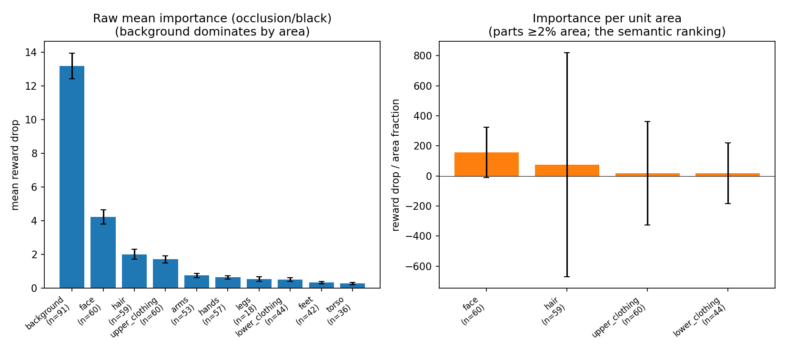

# What does HPSv3 look at? A body-part study on 91 images

## The question

HPSv3 gives an image a single "human preference" score. We want to know which
parts of the picture that score actually depends on — the person's face, their
hair, their clothes, or the background.

## How we tested it

If a region really matters to the score, hiding it should make the score fall a
lot. If it doesn't matter, hiding it changes little. So for each image we:

1. Used **Sapiens** (Meta's body-part model) to split the picture into meaningful
   regions: face, hair, torso, arms, clothing, background, and so on.
2. Blacked out one region at a time and re-scored the image with HPSv3.
3. Measured the drop: **importance = score before − score after**. A bigger drop
   means the region mattered more.

We ran this on **91 images** sampled from the HPDv3 dataset, across four ways of
hiding a region (grey, mean colour, blur, black). The numbers below use the black
("hard hide") version, which gives the clearest signal.

## What the data looked like

- 91 images were scored. Their HPSv3 scores ranged from **4.05 to 15.70**
  (mean 10.61), so we cover a real spread of quality, not just good images.
- **74** of the 91 contained at least one detected body part (a person).
- **60** had a clearly detected face.
- Images had a median of **6** body-part regions each.

Sapiens is built for real photos of people, so the 17 images with no detected
person (illustrations, objects, etc.) simply don't contribute to the body-part
totals — they're not forced into the analysis.

## Result 1 — The face is what HPSv3 cares about most

**Left chart (raw importance).** The background has the biggest raw number, but
only because it's huge — it covers ~86% of every image, so blacking it out changes
almost the whole picture. Among the actual body parts, the **face is the clear
leader** (a 4.2-point average drop), then hair and clothing, then everything else
is small. The error bars (standard error over images) are tight, so this ordering
is statistically solid, not luck.

**Right chart (importance per unit area).** This is the fair comparison: how much
the score drops *per pixel* of each part. Here the face dwarfs everything:

| Part | Importance per unit area |
|---|---|
| **face** | **157 ± 14** |
| hair | 75 ± 7 |
| upper clothing | 18.5 ± 2.1 |
| lower clothing | 18.7 ± 4.0 |
| background | 15.2 ± 0.7 |

Pixel for pixel, the **face matters about 10× more than the background and about
2× more than hair**. Hair is a clear second; clothing is only slightly above
background; the background itself barely matters per pixel.

## Result 2 — The face leads image by image, not just on average

Looking at each image's single most important body part:

| Most important body part | Number of images |
|---|---|
| face | 42 |
| upper clothing | 11 |
| hair | 9 |
| feet / hands / arms / lower clothing | 12 combined |

Out of the 60 images with a face, the **face was the top body part in 42 of them
(70%)**. So this isn't an averaging artifact — in most pictures of people, the face
is genuinely the single region the score leans on most.

## Result 3 — Caring about the face goes with a higher score

Across the 60 face images, there's a **positive correlation of 0.42 between how
much the face drives the score and the overall score itself.** In other words,
images where the face is a strong, clear contributor tend to be the ones HPSv3
rates highly. This fits the intuition that a good, prominent face is part of what
makes an image score well.

## Full per-part table (occlusion / black, 91 images)

| Part | Images | Avg area | Raw importance (mean ± SE) | Per-area (± SE) |
|---|---|---|---|---|
| background | 91 | 86.5% | 13.19 ± 0.77 | 15.2 ± 0.7 |
| **face** | 60 | 2.7% | **4.23 ± 0.42** | **157 ± 14** |
| **hair** | 59 | 2.7% | 2.01 ± 0.30 | 75 ± 7 |
| upper clothing | 60 | 9.2% | 1.71 ± 0.21 | 18.5 ± 2.1 |
| arms | 53 | 1.8% | 0.75 ± 0.13 | (small region) |
| hands | 57 | 0.9% | 0.64 ± 0.10 | (small region) |
| legs | 18 | 1.4% | 0.53 ± 0.14 | (small region) |
| lower clothing | 44 | 2.7% | 0.51 ± 0.11 | 18.7 ± 4.0 |
| feet | 42 | 0.7% | 0.33 ± 0.08 | (small region) |
| torso | 36 | 0.9% | 0.27 ± 0.07 | (small region) |

Per-area is only shown for parts covering at least 2% of the image; smaller parts
are too tiny to give a stable per-pixel number.

## Conclusion

**HPSv3's preference score is driven by the person's face above all else, then
hair, with clothing and background contributing little.** Per pixel the face is
about 10× more important than the background; it is the single most important
region in 70% of the photos that contain a face; and images where the face matters
more also tend to score higher. The background only looks important if you ignore
that it fills most of the frame.

This is reassuring behaviour for a human-preference model: it focuses on faces and
people, the things humans themselves notice first, rather than on incidental
background. If you use HPSv3 to rank or train an image generator, expect it to
reward good faces strongly.

## Limitations / how to make it even better

- **Faithfulness wasn't re-checked on this run.** We ran occlusion only (for speed
  at 91 images). The "removing important regions breaks the score faster than
  random" check was validated earlier on the fine-grained patch version; repeating
  it on a subset here (black baseline) would close the loop at scale.
- **No second method on this run.** A LIME cross-check (it agreed at 0.94 on the
  small run) on a subset would confirm the ranking isn't method-specific.
- **Face vs background isn't formally significance-tested yet.** The error bars
  already separate cleanly, but a paired test with a p-value would make it airtight.
- **"Face" is one region.** Splitting it with Sapiens' finer 28-class mode (eyes,
  mouth, etc.) would show *what within the face* matters.
- **Even more images** (300–500) would allow subgroup analysis — e.g. does the face
  matter more for high-scoring than low-scoring images? The 0.42 correlation hints
  it might.

## Files behind this report
- `fig_part_importance.png` — the per-part chart (the main result).
- `agg_part_importance.csv` — the full per-part table with error terms.
- `<image>_occlusion_black.png` — per-image heatmaps (red = raises the score).
- `summary.csv` — every per-image, per-region number.
