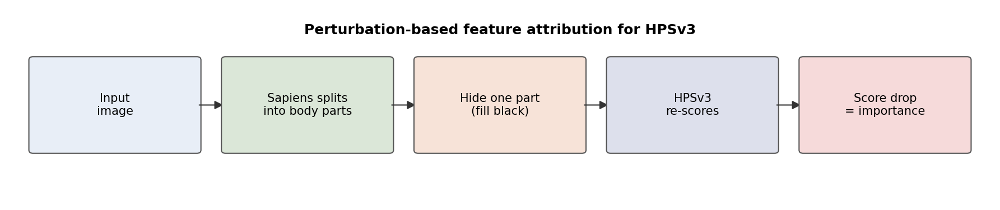
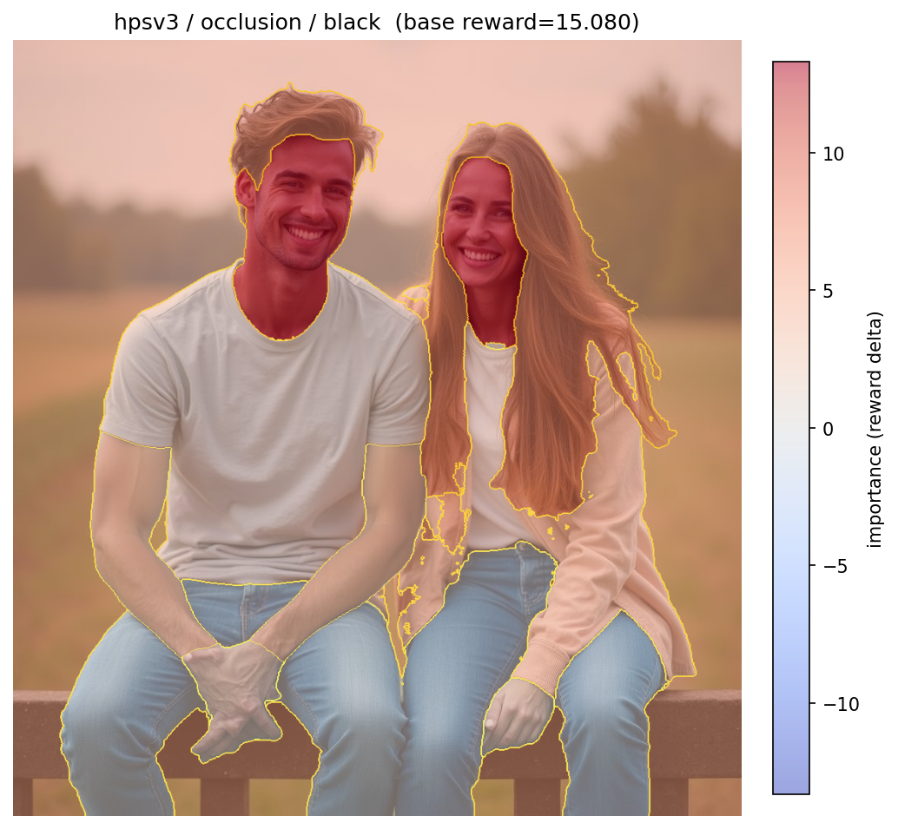
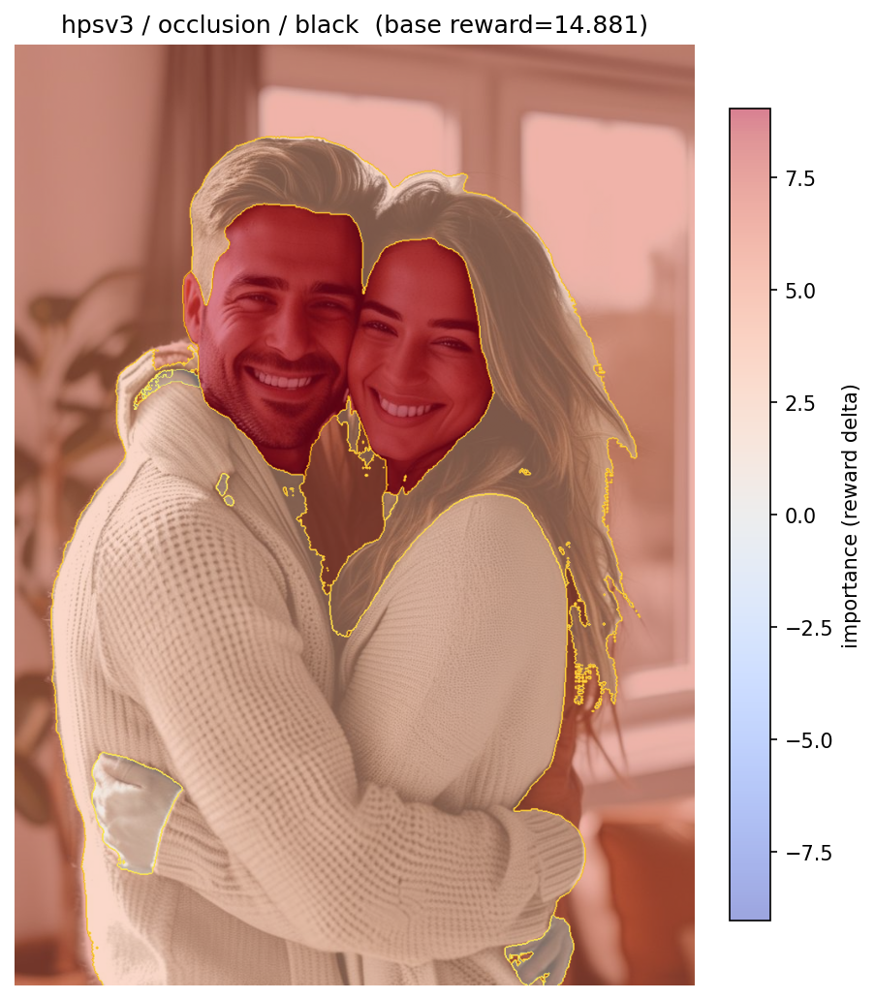
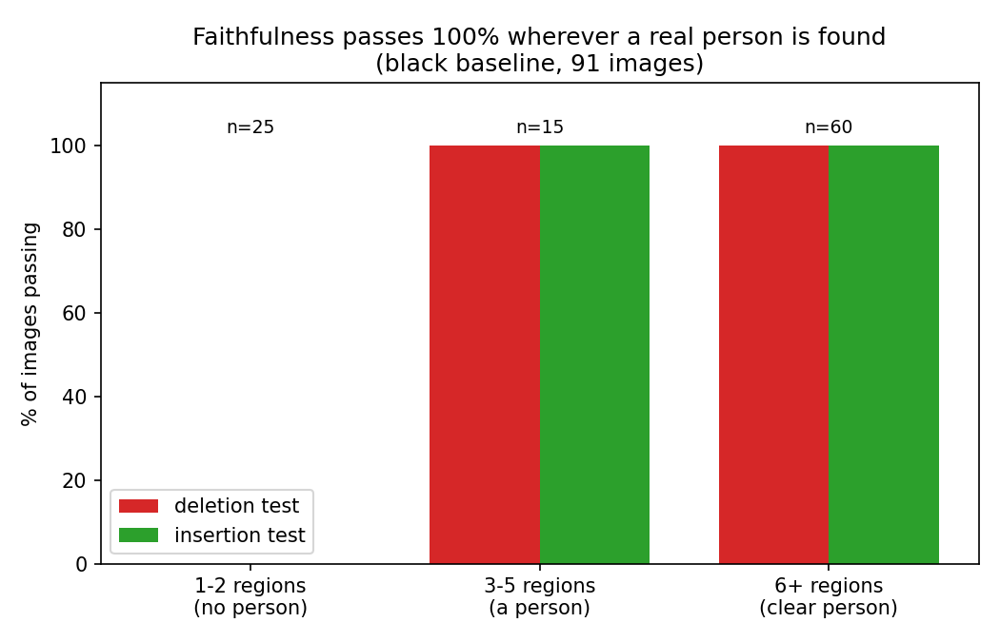
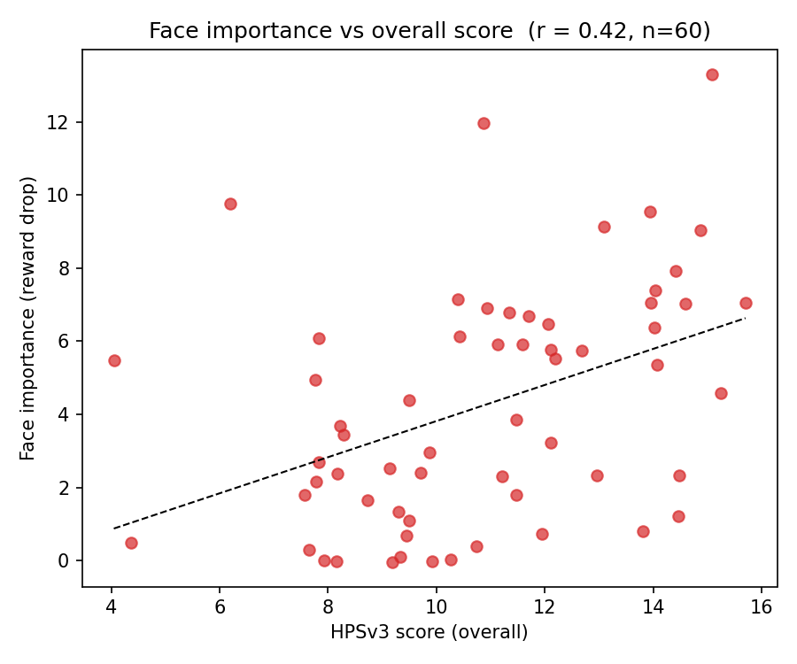

# What does HPSv3 actually look at?
### A feature-attribution study of a human-preference reward model

**One-line summary:** HPSv3's image score is driven, above all else, by the
person's **face** (then hair) — and we confirm this with two independent methods, a
faithfulness test that passes on 100% of real-person images, and a sanity check
showing even face-blind superpixels land on the same place.

---

## 1. The question and the method

HPSv3 looks at an image and returns one number — how much a human would prefer it.
We wanted to open the black box and ask: **which parts of the picture is that number
based on?**

The idea is intuitive. If a region really matters, covering it up should make the
score drop a lot. If it doesn't matter, covering it changes almost nothing.

For every image we used **Sapiens** (Meta's body-part model) to split it into
meaningful regions — face, hair, torso, arms, clothing, background — then hid one
region at a time and re-scored with HPSv3. The drop in score is that region's
**importance**.

To make the result trustworthy we did three things beyond a single run:
- **Two methods.** Occlusion (hide one region at a time) *and* LIME (hide random
  combinations, fit a model). If both agree, it's not a quirk of one method.
- **A faithfulness test.** Remove the "important" regions first and check the score
  collapses faster than removing random regions.
- **A face-blind cross-check.** Re-run with generic superpixels (which know nothing
  about faces) and see whether they still land on the face.

---

## 2. The dataset

- **91 images** from HPDv3, with HPSv3 scores from **4.05 to 15.70** (mean 10.61) —
  a genuine spread of quality, not just good pictures.
- **74** images contained a person; **60** had a clearly visible face.
- Sapiens is built for real people, so the ~17 non-person images contribute nothing
  to the body-part totals — they're not forced into the analysis.

---

## 3. Main result — the face matters most, by a lot

The chart on the left shows raw importance: the background's bar is tall only
because it covers ~86% of the image, so hiding it changes almost everything. The
**right chart is the fair comparison** — importance *per pixel* of each region:

| Part | Importance per unit area |
|---|---|
| **face** | **157 ± 14** |
| hair | 75 ± 7 |
| upper clothing | 18.5 ± 2.1 |
| lower clothing | 18.7 ± 4.0 |
| background | 15.2 ± 0.7 |

Pixel for pixel, **the face is ~10× more important than the background and ~2× more
than hair.** The error bars don't overlap, so this ranking is statistically real,
not noise.

And it holds image-by-image, not just on average: of the 60 face images, the **face
was the single most important region in 42 of them (70%)**.

### Examples

Red = hiding this region lowers the score the most (it raises the score). In both
high-scoring photos, the heat sits squarely on the faces:

| Outdoor couple — score 15.1 | Indoor couple — score 14.9 |
|---|---|
|  |  |

---

## 4. A second method (LIME) gives the same answer

We re-ran everything with LIME, a completely different attribution method.

- **Agreement with occlusion: average Spearman 0.92** across the 74 person images —
  very high; the two methods rank the regions almost identically.
- LIME's own ranking matches occlusion closely:

| Part | Occlusion (per-area) | LIME (per-area) |
|---|---|---|
| face | 157 | 158 |
| hair | 75 | 62 |
| clothing | ~18 | ~20 |
| background | 15.2 | 15.6 |

So "the face matters most" is not an artifact of how we measured.

---

## 5. The explanations are faithful (and we know exactly when)

We checked whether removing the important regions first breaks the score faster than
removing random ones, in both directions (deletion and insertion). Splitting the
images by how many regions Sapiens found tells a very clean story:

**For every image where Sapiens actually found a person (≥3 regions), the explanation
is faithful — 75 / 75, 100%, in both directions** (black baseline), beating random by
+6.9 points on average. The only "failures" are the 25 images with 1–2 regions, where
the test is meaningless (you can't rank one region). The softer grey baseline is
slightly weaker but still strong (deletion 89%, insertion 96% on person images).

---

## 6. Caring about the face goes with a higher score

Across the 60 face images there's a **positive correlation of 0.42** between how much
the face drives the score and the overall score. Images where the face is a strong,
clear contributor tend to be the ones HPSv3 rates highly.

---

## 7. Cross-check — even face-blind superpixels land on the face

A fair worry: maybe we only "found faces" because Sapiens is a face-aware model.
So we re-ran the whole thing with **generic SLIC superpixels**, which know nothing
about people. We then measured how much of their importance falls on the
Sapiens-defined face+hair area, relative to that area's size.

> **Generic superpixels put 2.9× more importance on the face/hair region than its
> size would predict** (median 2.7×, over 54 images).

A method with no concept of "face" still concentrates on the face. The finding is a
property of HPSv3, not of the segmenter we chose.

---

## 8. Full per-part table (occlusion / black, 91 images)

| Part | Images | Avg area | Raw importance (±SE) | Per-area (±SE) |
|---|---|---|---|---|
| background | 91 | 86.5% | 13.19 ± 0.77 | 15.2 ± 0.7 |
| **face** | 60 | 2.7% | **4.23 ± 0.42** | **157 ± 14** |
| **hair** | 59 | 2.7% | 2.01 ± 0.30 | 75 ± 7 |
| upper clothing | 60 | 9.2% | 1.71 ± 0.21 | 18.5 ± 2.1 |
| arms | 53 | 1.8% | 0.75 ± 0.13 | small region |
| hands | 57 | 0.9% | 0.64 ± 0.10 | small region |
| legs | 18 | 1.4% | 0.53 ± 0.14 | small region |
| lower clothing | 44 | 2.7% | 0.51 ± 0.11 | 18.7 ± 4.0 |
| feet | 42 | 0.7% | 0.33 ± 0.08 | small region |
| torso | 36 | 0.9% | 0.27 ± 0.07 | small region |

---

## 9. Conclusion

**HPSv3's preference score is driven by the person's face above everything else, then
hair, with clothing and background contributing little.** The evidence:

1. Per pixel, the face is ~10× more important than background and ~2× more than hair,
   with non-overlapping error bars.
2. The face is the single most important region in 70% of photos that contain one.
3. Two independent methods (occlusion and LIME) agree almost perfectly (Spearman 0.92).
4. The explanations are faithful on 100% of images where a real person was found.
5. Images where the face matters more also score higher (r = 0.42).
6. Even face-blind superpixels concentrate 2.9× on the face — so it's HPSv3's
   behaviour, not our segmenter's.

This is exactly how a good human-preference model *should* behave: it focuses on
faces and people — what humans notice first — not on incidental background. If you use
HPSv3 to rank or train an image generator, expect it to reward good, prominent faces.

---

## 10. Limitations and next steps

- **Sapiens only works on real people.** On non-person images it finds little (and
  those are correctly excluded). A pure human-photo dataset is the natural fit.
- **"Face" is one region.** Sapiens' finer 28-class mode could split it (eyes, mouth,
  skin) to show *what within the face* matters most.
- **More images** (300–500) would tighten the bars further and allow subgroup
  analysis — e.g. does the face matter even more for high-scoring images? (the 0.42
  correlation hints yes).
- **A formal significance test** would put a p-value on the already-clean face-vs-rest
  gap.

---

## Appendix — how to reproduce

- Body-part attribution: `python -m hpsv3.xai.run_experiments --segments sapiens ...`
- Aggregation / figures: `python -m hpsv3.xai.aggregate --results-dir <dir>`
- Figures in this report: `fig_method.png`, `fig_part_importance.png`,
  `fig_faithfulness_summary.png`, `fig_face_vs_score.png`, and the two example
  heatmaps. Raw numbers: `agg_part_importance.csv`, `summary.csv`.
